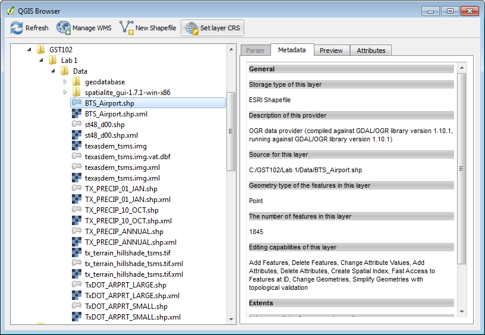
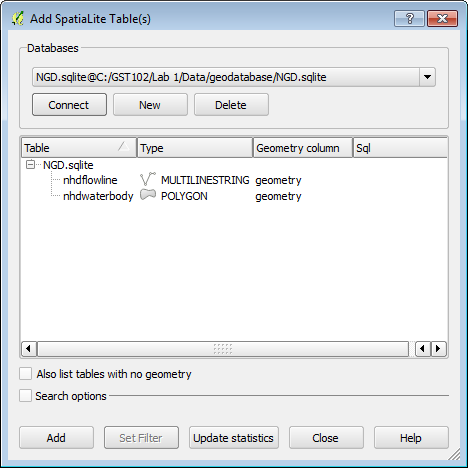
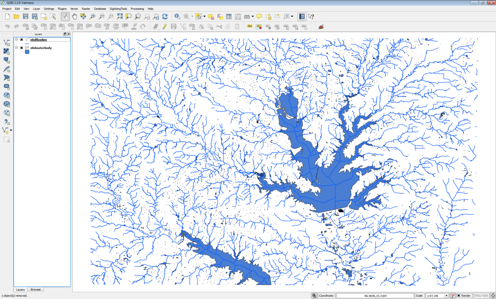
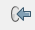
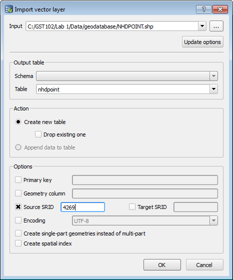
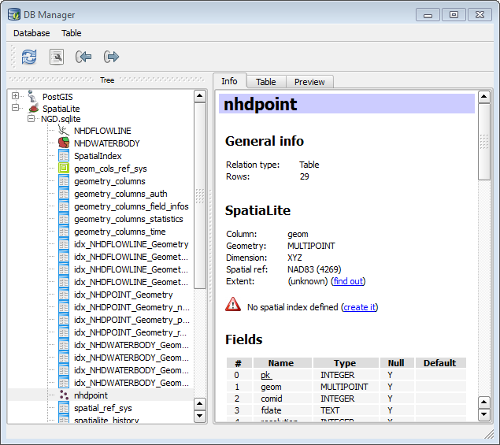

# GST 102: Spatial Analysis
## Lab 1 - Reviewing the Basics of Geospatial Data
### Objective – Explore data structures, file types, coordinate systems and attributes

Document Version: 9/17/2014

**FOSS4G Lab Author:**
Kurt Menke, GISP  
Bird's Eye View GIS

**Original Lab Content Author:**
Richard Smith, Ph.D.  
Texas A&M University - Corpus Christi

---

Copyright © National Information Security, Geospatial Technologies Consortium (NISGTC)

The development of this document is funded by the Department of Labor (DOL) Trade Adjustment Assistance Community College and Career Training (TAACCCT) Grant No.  TC-22525-11-60-A-48; The National Information Security, Geospatial Technologies Consortium (NISGTC) is an entity of Collin College of Texas, Bellevue College of Washington, Bunker Hill Community College of Massachusetts, Del Mar College of Texas, Moraine Valley Community College of Illinois, Rio Salado College of Arizona, and Salt Lake Community College of Utah.  This work is licensed under the Creative Commons Attribution 3.0 Unported License.  To view a copy of this license, visit http://creativecommons.org/licenses/by/3.0/ or send a letter to Creative Commons, 444 Castro Street, Suite 900, Mountain View, California, 94041, USA.  

This document was original modified from its original form by Kurt Menke and continues to be modified and improved by generous public contributions.

---

### 1. Introduction

This exercise features questions and activities designed to review some basic GIS and geospatial concepts. Please complete the exercise and turn in when you are finished. When asked to do something in the software, create a screen capture and put it into this document. 

This lab includes the following tasks:

+ Task 1 – GIS Data - Vector

+ Task 2 – GIS Data – Raster

+ Task 3 - Geodatabases

+ Task 4 – Coordinate Systems

+ Task 5 – GIS Data Attributes and Attribute Tables

###2 Objective: Use Basic Spatial Analysis Techniques to Solve a Problem

Spatial Analysis is a crucial aspect of GIS; the tools allow the user to analyze the patterns and relationships of the various data. Understanding the concepts of data structures, the variety of file formats, coordinates systems, and attributes are necessary in the design and the function of spatial analysis.

**There are two main data models within the GIS realm:**

+ Vector – a representation of the world using points, lines and polygons. Vector data is useful for storing data that has discrete boundaries.
 
	+ Points – use a single coordinate pair to define a location.

	+ Lines – uses an ordered set of coordinates to define a linear feature.

	+ o	Polygons – an area feature formed by a connected set of lines.

+ Raster – a representation of the world as a surface divided into a regular grid of cells. Raster models are useful for storing data that varies continuously such as an aerial photograph.

**Discrete and Continuous objects:**

+ Discrete – Data that represents phenomena with distinct boundaries. Property lines and streets are examples of discrete data. Discrete data can be stored via vector or raster data models. 

+ Continuous – Data such as elevation or temperature that varies without discrete steps. Continuous data is usually represented by raster data.

**Some Common Data Management Options:**

+ Shapefile – a GIS file format for vector data. 

+ GeoTiff – a GIS file format for raster data.

+ ERDAS Imagine *.img – a GIS file format for raster data

+ Geodatabase – a relational database capable of storing GIS data layers.

### 3 How Best to Use Video Walk Through with this Lab

To aid in your completion of this lab, each lab task has an associated video that demonstrates how to complete the task.  The intent of these videos is to help you move forward if you become stuck on a step in a task, or you wish to visually see every step required to complete the tasks.

We recommend that you do not watch the videos before you attempt the tasks.  The reasoning for this is that while you are learning the software and searching for buttons, menus, etc…, you will better remember where these items are and, perhaps, discover other features along the way.  With that being said, please use the videos in the way that will best facilitate your learning and successful completion of this lab.

### Task 1 GIS Data – Vector
You will examine the vector lab exercise data using QGIS Browser.

2.	Open QGIS Browser 2.2.0.
3.	Expand the GST 102\Lab 1\Data folder, so that the data are visible in the File Tree.  You should see 7 shapefiles, an ERDAS Imagine img file and a tif file along with several XML metadata files.
4.	To study the properties of each file select each one and choose the Metadata tab (figure below). 

5.	Studying the properties of each of the shapefiles listed below, write down the geometry type (point, line, polygon) and the number of features in the space provided below.

**Question # 1**

* 	BTS_Airport.shp

	* i.	Geometry:

	* ii.	Number of Features:

*  	St48_d00.shp

	* i.	Geometry:

	* ii.	Number of Features:

* 	TX_PRECIP_01_JAN.shp

	* i.	Geometry:

	* ii.	Number of Features:

* 	TX_PRECIP_ANNUAL.shp

	* i.	Geometry:

	* ii.	Number of Features:

* 	TxDOT_ARPRT_SMALL.shp

	* i.	Geometry:

	* ii.	Number of Features:

###Task 2	GIS Data  - Raster

Now you will examine the raster datasets provided with this lab.

1.	Open QGIS Browser 2.2.0.
	
2.	Expand the GST 102\Lab 1\Data folder, so that the data are visible in the File Tree.  Along with the shapefiles you will see an ERDAS Imagine raster img file and a GeoTiff file along with several XML metadata files.
	
3.	To study the properties of each raster, select each one, and choose the Metadata tab.
	 
4.	Record the file format. This will be listed under the Driver section. (You can record the last line of that description which is the file format.) You will also record the pixel Dimensions and the Spatial Reference System in the space provided below.

**Question # 2**

*	Texasdem_tsms.img

	* i.	File format:

	* ii.	Dimensions:

	* iii.	Spatial Reference System:

* b.	tx_terrain_hillshade_tsms.tif
	* i.	File format:

	* ii.	Dimensions: 
 
	* iii.	Spatial Reference System:

**Question # 3: Do these look to be discrete or continuous raster datasets?**

### Task 3 Geodatabase

This task will introduce you to another file format, the geodatabase. You’ll use QGIS Desktop to connect to, and explore the data contained in a SpatiaLite database. SpatiaLite is a SQLite database engine with spatial functions added. This means that spatial data layers can be stored in the relational database.

1.	Open QGIS Desktop 2.2.0
2.	Click the Add SpatiaLite Layer button   opening the Add SpatiaLite Table(s) window.
3.	Click the New button to establish a connection to a SpatiaLite database.
4.	Select the C:\GST102\Lab 1\Data\geodatabase\NDG.sqlite file and click Open.
5.	Click Connect in the Add SpatiaLite Table(s) window (figure below).

6.	You will see two layers: nhdflowline and nhdwaterbody. Select both by clicking on them with the Ctrl key held down.
7.	Click Add to add them to QGIS (figure below).

8.	Now you will import a shapefile into the NDB SpatiaLite geodatabase. From the menu bar choose Database -> DB Manager to open the DB Manager window. Expand the SpatiaLite section and the NGD.sqlite geodatabase. You will see the two layers and many other tables (figure below). These other tables store information about the geometry and coordinate reference systems of GIS data. 

9.	Click the Import Layer/File   button to open the Import vector layer window.
10.	Click the ellipsis   button to the right of the Input section to open the Choose the file to import window. Navigate to C:\GST102\Lab 1\Data\geodatabase folder and select NHDPOINT.shp. Click Open.
11.	Name the Output table ‘nhdpoint’. Make sure Create new table option is checked. Under Options check Source SRID and type in 4269. This is the EPSG code for the geographic coordinate system NAD83. This is the CRS of the NHDPOINT shapefile (figure below). Click OK.

12.	You should get a message that the Import was successful. Click OK.
13.	Click the Refresh   button on the DB Manager. You should now see nhdpoint listed as a new table in the database with a point icon   (figure below). 

14.	Right click on the nhdpoint layer in the DB Manager and choose Add to canvas. Close the DB Manager.

15.	You should now see the new point data added to QGIS (figure below). You have connected to a geodatabase and imported a shapefile into the database.

16.	Open QGIS Browser. Expand the SpatiaLite database connection. Notice that you are now connected to the NGD.sqlite database (figure below).

17.	You have successfully connected to a SpatiaLite geodatabase and imported a shapefile into the database!

**Question # 4:**
 What is a reason to import source data into a geodatabase?

### Task 4 Coordinate Systems
Now you will explore the coordinate reference systems of the lab data. 

1.	Open QGIS Browser.
2.	By using the Metadata tab identify the coordinate reference system for the following datasets. Record your answers below:

**Question #5:**

+	St48_d00.shp: 

+ 		texasdem_tsms.img:

+ 		TxDOT_ARPRT_SMALL.shp 

3.Now, close QGIS Browser and QGIS Desktop. Start QGIS Desktop creating a new blank map.

4.Add the BTS_AIRPORT.shp shapefile to QGIS Desktop by clicking the Add vector data button and browsing for the shapefile

5.To identify the coordinate system of the shapefile right click and choose Properties from the context menu. Click on the General tab. Under Coordinate reference system you’ll see the CRS.

**Question #6: What is the current coordinate system of this data?**

6.	Let us say for purposes of our analysis that we would like to change the coordinate system of the BTS_Airport.shp layer.

7.	Right click on the layer in the Table of Contents and choose Save as….

8.	Reproject this layer to UTM Zone 14, NAD83 (figure below).

### Task 5 GIS Data Attributes and Attribute Tables###

1.	If you have previously closed QGIS Desktop, reopen it and add the st48_d00.shp shapefile and the TxDOT_ARPRT_SMALL.shp shapefile to your map canvas. 
2.	Open the attribute table for the TxDOT_ARPRT_SMALL.shp shapefile by right-clicking ->Open Attribute Table. 

**Question #7: How many records are in this table?**

***Question #8: How many attributes does each point in this shapefile have?*** 

3.	Open the attribute table for the st48_d00.shp shapefile.

**Question #9: How many records are in this table?**

**Question #10: How many attributes does the polygon in this shapefile have?**

**Question #11: If you wanted to identify all Regional airports from the TxDOT_ARPRT_SMALL shapefile how would you do that?**

### 5 Conclusion
In this lab, you were able to identify the data models, geometry and number of features for several lab data sets. You connected to a SpatiaLite geodatabase and imported a shapefile into it. You identified the coordinate reference systems of data and reprojected a dataset into a new shapefile. Finally you reviewed working with attribute tables. Knowing how to determine the characteristics of datasets is a necessary step in spatial analysis.

### 6 Discussion Questions

1.	What is the importance of coordinate systems? Why are there so many different coordinate systems and map projections?

2.	Describe the pros and cons of rasters and vectors.

