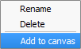

# GST 102: Spatial Analysis
## Lab 1 - Reviewing the Basics of Geospatial Data
### Objective – Explore data structures, file types, coordinate systems and attributes

Document Version: 4/2/2015

**FOSS4G Lab Author:**
Kurt Menke, GISP  
Bird's Eye View GIS

**Original Lab Content Author:**
Richard Smith, Ph.D., GISP
Texas A&M University - Corpus Christi

---

The development of the original document was funded by the Department of Labor (DOL) Trade Adjustment Assistance Community College and Career Training (TAACCCT) Grant No.  TC-22525-11-60-A-48; The National Information Security, Geospatial Technologies Consortium (NISGTC) is an entity of Collin College of Texas, Bellevue College of Washington, Bunker Hill Community College of Massachusetts, Del Mar College of Texas, Moraine Valley Community College of Illinois, Rio Salado College of Arizona, and Salt Lake Community College of Utah.  This work is licensed under the Creative Commons Attribution 3.0 Unported License.  To view a copy of this license, visit http://creativecommons.org/licenses/by/3.0/ or send a letter to Creative Commons, 444 Castro Street, Suite 900, Mountain View, California, 94041, USA.

This document continues to be modified and improved by generous public contributions.

---

### 1. Introduction

This exercise features questions and activities designed to review some basic GIS and geospatial concepts. Throughout the lab, questions will be asked for you to answer. Create a new document to write your answers and refer back using the question number.

This lab includes the following tasks:

+ Task 1 – GIS Data - Vector
+ Task 2 – GIS Data – Raster
+ Task 3 - Geodatabases
+ Task 4 – Coordinate Systems
+ Task 5 – GIS Data Attributes and Attribute Tables

###2 Objective: Use Basic Spatial Analysis Techniques to Solve a Problem

Spatial Analysis is a crucial aspect of GIS; the tools allow the user to analyze the patterns and relationships of the various data. Understanding the concepts of data structures, the variety of file formats, coordinates systems, and attributes are necessary in the design and the function of spatial analysis.

**Discrete and Continuous objects:**

+ Discrete – Data that represents phenomena with distinct boundaries. Property lines and streets are examples of discrete data. Discrete data can be stored via vector or raster data models. 

+ Continuous – Data such as elevation or temperature that varies without discrete steps. Continuous data is usually represented by raster data.

**There are two main data models within the GIS realm: Vector and Raster**

+ Vector – a representation of the world using points, lines and polygons. Vector data is useful for storing data that has discrete boundaries.
	+ Points – use a single coordinate pair to define a location.
	+ Lines – uses an ordered set of coordinates to define a linear feature.
	+ Polygons – an area feature formed by a connected set of lines.
+ Raster – a representation of the world as a surface divided into a regular grid of cells. Raster models are useful for storing data that varies continuously such as an aerial photograph.

**Common Data Storage Formats:**

+ Shapefile (.shp) – a GIS file format for vector data.
+ GeoTiff (.tif/.tiff) – a GIS file format for raster data.
+ ERDAS Imagine (.img) – a GIS file format for raster data
+ Geodatabase (.gdb/.mdb/.sqlite) – a relational database capable of storing GIS data layers.

### Task 1 - GIS Data – Vector
Examine the vector lab exercise data using QGIS Browser.

2. Open QGIS Browser.
3. Navigate to and expand the Lab 1 Data folder so that the data are visible in the File Tree.
4. You should see 7 shapefiles, an ERDAS Imagine file, a GeoTiff file, and several XML metadata files.
4. To study the properties of each file select each one and choose the Metadata tab (see figure below). 

**Question # 1: Studying the properties of each of the shapefiles listed below, write down the geometry type (point, line, polygon) and the number of features in the space provided below.**

* BTS_Airport.shp
	* Geometry:
	* Number of Features:

* St48_d00.shp
	* Geometry:
	* Number of Features:

* TX_PRECIP_01_JAN.shp
	* Geometry:
	* Number of Features:

* TX_PRECIP_ANNUAL.shp
	* Geometry:
	* Number of Features:

* TxDOT_ARPRT_SMALL.shp
	* Geometry:
	* Number of Features:

###Task 2 - GIS Data - Raster

Examine the raster datasets provided with this lab.

1. Open QGIS Browser.
2. Expand the Lab 1 Data folder, so that the data are visible in the File Tree.
3. Along with the shapefiles you will see an ERDAS Imagine raster file and a GeoTiff raster file along with several XML metadata files.
3. To study the properties of each raster, select each one, and choose the Metadata tab.

**Question # 2: Record the file format. This will be listed under the Driver section. (You can record the last line of that description which is the file format.) You will also record the pixel Dimensions and the Spatial Reference System in the space provided below.**

* Texasdem_tsms.img
	* File format:
	* Dimensions:
	* Spatial Reference System:

* tx_terrain_hillshade_tsms.tif
	* File format:
	* Dimensions: 
	* Spatial Reference System:

**Question # 3: Do these look to be discrete or continuous raster datasets?**

### Task 3 - Geodatabase

This task will introduce you to another file format, the geodatabase. You’ll use QGIS Desktop to connect to, and explore the data contained in a SpatiaLite database. SpatiaLite is a SQLite database engine with spatial functions added. This means that spatial data layers can be stored in the relational database.

1. Open QGIS Desktop.
2. Click the Add SpatiaLite Layer button   opening the Add SpatiaLite Table(s) window.
3. Click the New button to establish a connection to a SpatiaLite database.
4. Select the Lab 1 Data\\geodatabase\\NDG.sqlite file and click Open.
5. Click Connect in the Add SpatiaLite Table(s) window to connect to the geodatabase and see the contents (see figure below).

6. You will see two layers: nhdflowline and nhdwaterbody. Select both by clicking on them with the Ctrl key held down.
7. Click Add to add them to the map canvas in QGIS Desktop (see figure below).

8. Now you will import a shapefile into the NDB SpatiaLite geodatabase. From the menu bar choose Database | DB Manager | DB Manager to open the DB Manager window.
9. Expand the SpatiaLite section and the NGD.sqlite geodatabase. You will see the two layers and many other tables (see figure below). These other tables store information about the geometry and coordinate reference systems of GIS data. 

9. Click the Import Layer/File   button to open the Import vector layer window.
10. Click the ellipsis   button to the right of the Input section to open the Choose the file to import window. 
11. Navigate to Lab 1 Data\\geodatabase folder and select NHDPOINT.shp. Click Open.
11.	Name the Output table ‘nhdpoint’.
12.	Under Options check Source SRID and type in 4269. This is the EPSG code for the geographic coordinate system NAD83. 
13. Check your options again the figure below. If they match, click OK to import the shapefile into the database.

12. You should get a message that the Import was successful. Click OK.
13. Click the Refresh  button on the DB Manager. You should now see nhdpoint listed as a new table in the database with a point icon (shown in figure below). 

14. Right-click on the nhdpoint layer in the DB Manager and choose Add to canvas. Close the DB Manager.

15. You should now see the new point data added to QGIS (shown in figure below). You have successfully connected to a geodatabase and imported a shapefile into the database.

16. Open QGIS Browser. Expand the SpatiaLite database connection. Notice that you are now connected to the NGD.sqlite database (see figure below).

17. You have successfully connected to a SpatiaLite geodatabase and imported a shapefile into the database!

**Question # 4:**
What is a reason to import source data into a geodatabase?

### Task 4 - Coordinate Systems

Explore the coordinate reference systems of the lab data. 

1. Open QGIS Browser.
2. Using the Metadata tab, identify the coordinate reference system for the following datasets in the Lab 1 Data folder. Record your answers below:

**Question #5:**

+ St48_d00.shp:

+ texasdem_tsms.img:

+ TxDOT_ARPRT_SMALL.shp 

3. Now, close QGIS Browser. Start QGIS Desktop creating a new blank map.
4. Add the BTS_AIRPORT.shp shapefile to QGIS Desktop by clicking the Add vector data button and browsing for the shapefile
5. To identify the coordinate system of the BTS_Airport shapefile right-click on the layer in the Layers Panel and choose Properties from the context menu.
6. Click on the General tab in the Layer Properties window. Under the Coordinate reference system section, you will see the coordinate reference system of the layer.

**Question #6: What is the current coordinate system of this data?**

Let us say for purposes of our analysis that we would like to change the coordinate system of the BTS_Airport.shp layer.
7. Right click on the layer in the Layers panel and choose Save as…. This will open the Save vector layer as window.
8. Referencing the figure below, reproject this layer to UTM Zone 14, NAD83 and have it added to the map canvas.

### Task 5 - GIS Data Attributes and Attribute Tables###

1. Open QGIS Desktop and start a new, empty project.
2. Add State_of_Texas.shp and TxDOT_ARPRT_SMALL.shp to the map canvas.
2. Open the attribute table for the TxDOT_ARPRT_SMALL.shp shapefile by right-clicking on it in the Layers panel then choosing Open Attribute Table from the context menu. 

**Question #7: How many records are in this table?**

***Question #8: How many attributes does this shapefile have?*** 

3. Open the attribute table for the State_of_Texas.shp shapefile.

**Question #9: How many records are in this table?**

**Question #10: How many attributes does this shapefile have?**

**Question #11: If you wanted to identify all Regional airports from the TxDOT_ARPRT_SMALL shapefile on the map how would you do that?**

### 4 Conclusion
In this lab, you were able to identify the data models, geometry, and number of features for several lab data sets. You connected to a SpatiaLite geodatabase and imported a shapefile into it. You identified the coordinate reference systems of data and reprojected a dataset. Finally, you reviewed working with attribute tables. Knowing how to determine the characteristics of datasets is a necessary step in spatial analysis.

### 5 Discussion Questions

1. What is the importance of coordinate reference systems? Why are there so many different coordinate systems and map projections?
2. Describe the pros and cons of rasters and vectors.