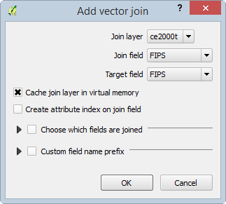

# GST 102: Spatial Analysis
## Lab 2 - Introduction to Geospatial Analysis
### Objective – Understand Attribute Table Joins and Data Classification

Document Version: 4/2/2015

**FOSS4G Lab Author:**
Kurt Menke, GISP
Bird's Eye View GIS

**Original Lab Content Author:**
Richard Smith, Ph.D., GISP
Texas A&M University - Corpus Christi

---

The development of the original document was funded by the Department of Labor (DOL) Trade Adjustment Assistance Community College and Career Training (TAACCCT) Grant No.  TC-22525-11-60-A-48; The National Information Security, Geospatial Technologies Consortium (NISGTC) is an entity of Collin College of Texas, Bellevue College of Washington, Bunker Hill Community College of Massachusetts, Del Mar College of Texas, Moraine Valley Community College of Illinois, Rio Salado College of Arizona, and Salt Lake Community College of Utah.  This work is licensed under the Creative Commons Attribution 3.0 Unported License.  To view a copy of this license, visit http://creativecommons.org/licenses/by/3.0/ or send a letter to Creative Commons, 444 Castro Street, Suite 900, Mountain View, California, 94041, USA.

This document continues to be modified and improved by generous public contributions.

---

### 1. Introduction

GIS data comes in many formats. As you collect data from various sources on the internet, you will realize that the data you acquire will not always be spatially enabled. There may be a spatial component to the data, but it is not yet a GIS dataset. For example, you may have an Excel spreadsheet with county population statistics. The data has a spatial component, county designation, however, it is not data that is ready to be mapped.  In this lab you will learn how to perform a table join to attach data to the attribute table of an existing GIS dataset. You will then learn how to classify the data.

This lab includes the following tasks:

+ Task 1 – Data Exploration and Joins
+ Task 2 – Data Classification

### 2 Objective: Explore and Understand Geospatial Data Models

In this lab we will look at some tabular data and determine how to join it to an existing dataset. This is a common data preparation step before we begin an analysis.

Join – Appending the fields of one table, to those of another table, based on a common attribute. Typically, joins are performed to attach more attributes to the attribute table of a geographic layer.

Classification – the process of breaking up data values into meaningful groups.

### Task 1 - Data Exploration and Joins
	
The data for this lab includes one shapefile: U.S. County boundaries (countyp010). The layer covers only the lower 48 contiguous states. There is also one tabular dataset: U.S. Census data (ce2000t.dbf) for counties. 

In order to map the data in the table, we will need to join it to the county shapefile. In order to perform such a join there needs to be a common attribute between the table and the shapefile. 

1. Open QGIS Desktop and add the County shapefile.
3. Open the attribute table and examine the contents (shown in figure below).

You can see that there are 3,283 records in the table. What kind of attributes does this data set have? The Area and Perimeter fields are created as part of the file format (shapefile). These represent the area and perimeter of each feature in map units. Since this dataset is in the Geographic Coordinate System these units are in decimal degrees. This is a difficult unit to work with so these don’t add much information. The Square_Mil field at the far right is much more useful. This holds the area of each polygon in square miles. CountyP010 is an unique ID. Then there are fields for State abbreviation, county name and FIPS codes. 

FIPS stands for Federal Information Processing Standards. They are unique codes for census designations. Each state has a FIPS code and each county has a FIPS code. This data set has a column for the State_FIPS but not the county fips alone. The first two digits in the FIPS column are the State FIPS code. The last three digits in the FIPS column are the County FIPS code. Combining both State and County FIPS codes provides a unique ID for each county in the U.S.

With this data, you can identify the state and county names and the size of each county. Now you will examine one of the standalone tables. 

5. Close the county attribute table. 
6. To add a table click the Add Vector Data button and browse to the lab data folder. Set the file type filter to All Files (\*)(\*.\*). Select the ce2000t.dbf file and add it to QGIS Desktop.
7. Right click on the table and choose Open Attribute Table from the context menu. Examine the attributes.
8. This table contains many fields of socioeconomic data such as total population, population by age, population by gender etc. 

What field can be used to join this to the Counties attribute table? At first you might think the County column would work. Click the County column header so that an upward facing arrow appears. (Remember that this allows you to toggle back and forth between an ascending and descending sort of the data.)

Notice that there are numerous Adams County entries from several states (shown in figure below). Therefore, County name is not a unique ID. However, the FIPS column is a unique ID that will be used to join to the FIPS column in the shapefile.

10. Close the attribute table.
11. Right click on the countyp010 layer and choose Properties from the context menu to open the Layer Properties window.
12. Click on the Joins tab. This is where you configure joins for the layer. 
13. Click the Add Join button  . The Add vector join window opens. 

The Join layer is the table you will join to the shapefiles attribute table. Since you only have one table in your Table of Contents there is only one choice: ce2000t. Since you’ve previewed both the county layer attribute table and ce2000t you know that the Join field is FIPS and the Target field is also FIPS.

14. Set the Join field to FIPS.
15. Set the Target field to FIPS.

*Note*: In this example both join fields have the same name. However, this is not a requirement. Both fields do need to have the same data type. For example, they need to both be text fields or both integer fields.

14. Click OK.
15. You will see the join show up in the Join window (shown in figure below). The join has now been created.

16. Click OK on the Layer Properties window to close it.
17. Re-open the countyp010 attribute table.  You will see all the additional fields appended to the right side.

This join exists only within this QGIS Desktop document. In other words the data haven’t been physically added to the shapefile. However, within this map document the new fields will act as all the others. Let's make the join permanent.

19. Right-click on the county layer in the Layers panel and choose Save as… from the context menu. This will allow you to save a new copy of the countyp010 shapefile with the new attributes included.
20. Name the new shapefile countyp010_census.shp in your lab directory and add it to the map canvas (options shown in figure below).

20. You can now remove the original county layer from the map by right-clicking on it in the Layers panel and choosing Remove from the context menu.
21. Save the project as Lab 2.qgs in your lab directory.

### Task 2 - Classification
Now that you’ve joined data to the counties layer, you will explore different ways to symbolize the data based on the new attributes.

1. Open QGIS Desktop and open Lab 2.qgs if it is not already open.
2. From the menu bar choose Project | Project Properties, click on the CRS tab and ensure that Enable ‘on the fly’ CRS transformation is checked.
3. In the Filter window type 5070. This is the EPSG code for the Albers Equal Area projection for the continental U.S.
4. Select the NAD83/Conus Albers coordinate systems for the map and click OK.
4. The data should now resemble the figure below.

5. Open the Layer Properties for the county_010_census layer and click on the Style tab.
6. Instead of the default Single Symbol renderer, choose the Graduated renderer. This allows you to choose a numeric field and classify the data into categories.
7. Choose ce2000t_PO as the Column. This field has the total population in 2000. 
8. Click the Classify button to create five classes and assign a color to each class. 
9. Keep all of the other options as their default value (shown in the figure below) and click OK.

The color ramp may differ but your map should resemble the figure below. QGIS has divided the data values into five groupings and applied a color ramp across the categories. This first classification does not tell much of a story.

9. Open up the Layer Properties | Style tab again. The default classification Mode used was Equal Interval. This default mode attempts to create classes with the equal data value intervals.
10. Change the Mode to Natural Breaks (Jenks). Notice the data values change. This is an algorithm that calculates natural groupings of a series of data values. 
11. Click OK to set the new classification.

This is a more informative portrayal of the data. There large population centers are more visible now (shown in the figure below).

11. Open up the Layer Properties | Style tab again.
12. Change the Mode to Quantile (Equal Count). Notice the data values change. This is an algorithm that attempts to put the same number of features into each class. 
13. Click OK to set the new classification.

This is a much more informative depiction of total population (shown in the figure below).

13. Open up the Layer Properties | Style tab again.
14. In addition to changing the mode, you can change the number of classes. Change the number of classes to 4 and click Apply to see the difference on the map.
14. You can also change the Color ramp. Click the drop down arrow to the right of Color ramp and choose RdBu .
15. Click Apply. This highlights rural counties with a red color (shown in the figure below).

*Tip*: You can also click the Invert option to have the color ramp reversed.

*Note*: Sometimes you need to change to another color ramp, and back to the one you want to use, to have the Inversion take effect. 

*Final Note*: You can change the Legend for each class. Instead of the bottom class having values of 67-11566.75, you can double click on the label text for a class and change it. For example, you could change the least populated class label to ‘Rural’. This is shown in the figure below.

### 3 Conclusion
In this lab, you learned to join tabular data with a spatial component to a shapefile. Once that was complete, you were able to classify the data and produce different renderings of that data. Between the various classification modes, choosing the number of classes and the color ramp you have endless possibilities for displaying numeric data. The key is to remember what data pattern you are trying to share with the map reader. Then you must find a classification theme that will tell the story. These are common techniques for dealing with numeric data on maps. 

### 4 Discussion Questions

1. Describe the use of a join in GIS?
2. Why might you want to preserve a join outside of a QGIS map document by exporting the joined layer, versus just working with the join in the map document?
3. Why would you classify data?

### 5 Challenge Assignment (optional)

There are several more datasets in the Lab 2 Data/ChallengeData directory. There is a World_Countries shapefile and two tabular datasets: CO2_Readings_World.xls and RenewableEnergy_Percentages.dbf. Both of these tabular formats can be brought into QGIS Desktop as tables. Identify the fields by which these two tables can be joined to the World_Countries shapefile. *Note*: You can add additional joins to a shapefile by just repeating the process in Task 1.

Once you have joined the data make two maps: 1) Showing CO2 readings by country and 2) RenewableEnergy_Percentages by country.