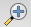
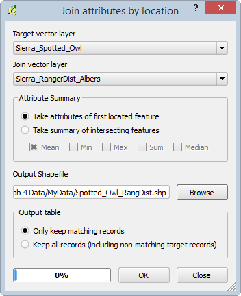

# GST 102: Spatial Analysis
## Lab 4 - Vector Data Analysis - Overlay Techniques
### Objective - Understanding Basic Vector Analysis Using Overlays

Document Version: 4/5/2014

**FOSS4G Lab Author:**
Kurt Menke, GISP  
Bird's Eye View GIS

**Original Lab Content Author:**
Kurt Menke, GISP  
Bird's Eye View GIS

---

The development of the original document was funded by the Department of Labor (DOL) Trade Adjustment Assistance Community College and Career Training (TAACCCT) Grant No.  TC-22525-11-60-A-48; The National Information Security, Geospatial Technologies Consortium (NISGTC) is an entity of Collin College of Texas, Bellevue College of Washington, Bunker Hill Community College of Massachusetts, Del Mar College of Texas, Moraine Valley Community College of Illinois, Rio Salado College of Arizona, and Salt Lake Community College of Utah.  This work is licensed under the Creative Commons Attribution 3.0 Unported License.  To view a copy of this license, visit http://creativecommons.org/licenses/by/3.0/ or send a letter to Creative Commons, 444 Castro Street, Suite 900, Mountain View, California, 94041, USA.

This document was original modified from its original form by Kurt Menke and continues to be modified and improved by generous public contributions.

---

### 1 Introduction

In this lab, you will be learn about several powerful vector analysis tools. The tools are all considered overlay tools, since they produce outputs defined by how features overlap one another. You will be working with several datasets covering the Sierra National Forest in California.
This lab includes the following tasks:

+ Task 1 - Clip
+ Task 2 - Intersection
+ Task 3 - Union
+ Task 4 - Join Attributes by location

### 2 Objective Understanding Basic Vector Analysis Using Overlays

The objective of this lab is for the student to understand basic use of vector overlays in a geospatial analysis. 

**Vector Overlays** – A set of tools, which work on the spatial relationships between two input datasets. The output is a new dataset derived from those spatial relationships. 

**Clip** – Outputs the features of the input dataset that are within the features of the clip dataset. It is commonly used to cut datasets to the study area boundary.

**Intersection** – Takes two polygon datasets and outputs the areas common to both.

**Union** – A topological overlay of two polygon datasets, the output preserves the features that fall within the spatial extent of either input dataset.

**Join Attributes by Location** – Also known as a spatial join, this operation appends the attribute columns of one data set to another, based on the geographic intersection of the two datasets.

### Task 1 - Clip
	
This lab focuses on the Sierra National Forest in California. Datasets include: the National Forest boundary, Ranger Districts, and habitat data for both spotted owl and Southwest willow flycatcher. In this first task, you will be clipping data to the study area. The spotted owl is listed as Threatened and the southwest willow flycatcher is listed as endangered by the U.S. Fish and Wildlife Service.

*Photo credit: Jim Rorabaugh/USFWS [Public domain]*

*Photo credit: John and Karen Hollingsworth; photo by USFS Region 5 (Pacific Southwest) [Public domain]*

1. Open QGIS Desktop.
2. From the lab directory, add both the Sierra_Natl_Forest.shp and CA_Spotted_Owl_HmRngCore.shp shapefiles to QGIS Desktop.
3. Move the Sierra National Forest layer below the spotted owl layer so the map canvas resembles the figure below.

 

In this case, you are only interested in the data covering the Sierra National Forest. Notice that the spotted owl data covers far more territory than the forest. Therefore, you will clip the spotted owl data to the forest boundary. Clip will create a new shapefile consisting of the spotted owl polygons within the forest boundary. It is standard protocol to clip datasets to the extent of the study area. This reduces data to only that which needs to be processed, and makes processing and rendering faster.

Before conducting a spatial analysis, you need to ensure that all the involved layers are in the same coordinate reference system.

4. Open the Layer Properties for each layer, and identify the coordinate reference system.

**Question # 1 – Are both layers in the same coordinate reference system? What is the coordinate reference system of each layer?**

5. From the menu bar choose Vector | Geoprocessing Tools | Clip. This will open the Clip tool. Enter the following options:
	
	a. Input vector layer = CA_Spotted_Owl_HmRngCore

	b. Clip layer = Sierra_Natl_Forest

	c. Output shapefile = Lab 4 Data/MyData/Sierra_Spotted_Owl.shp

	d. Check Add result to canvas

	e. Click OK

	f. Click Close

6. The new layer will appear in the Layers panel. Remove the original CA_Spotted_Owl_HmRngCore layer as we no longer need it.
7. Right-click on the Sierra_Natl_Forest layer and choose Zoom to Layer.

Your map should now resemble the figure below. Unlike selecting by location and exporting the selected set to a new layer, the Clip operation actually cuts spotted owl polygons at the forest boundary where they crossed the forest boundary.

 

8. Save the project as Lab 4.qgs in the data folder.

### Task 2 - Intersection
You will now include the southwest willow flycatcher habitat data in the analysis.

1. Open QGIS Desktop and open Lab 4 Data/Lab 4.qgs if it is not already.
2. Add Sierra_WillowFlycatcher.shp shapefile to QGIS Desktop. This data set falls completely within the forest boundary so there is no need to clip it.
3. Drag the Sierra_WillowFlycatcher layer to the top of the layers list in the Layers panel so it draws on top of all other layers.

3. Spend a few minutes styling your data.

	a. Give the National forest a light green color and black outline.

	b. Give the spotted owl habitat an orange fill and black.

	c. Give the Southwest willow flycatcher habitat a red fill and red outline.

4. Your map should now resemble the figure below.

 

5. Use the Zoom in tool   to drag a box and zoom in to the area outlined in black in the figure above.

You will notice that in this area, there is some overlap between the Southwest willow flycatcher and spotted owl habitat (shown figure below). Since these are both sensitive species, areas of habitat overlap will be important areas to protect. You could certainly conduct a spatial query to select Southwest willow flycatcher polygons that overlap spotted owl polygons. However, here you will see the value of using the Intersect tool to identify these overlapping areas.

6. From the menu bar choose Vector | Geoprocessing Tools | Intersect. Fill out the form with the following (also shown in figure below):

	a. Input vector layer = Sierra_Spotted_Owl

	b. Intersect layer = Sierra_WillowFlycatcher

	c. Ouput shapefile = Lab 4 Data/MyData/OverlapAreas.shp

	d. Add result to canvas checked

7. When finished, Click OK to perform the intersect operation, and then click Close.
8. Drag the OverlapAreas layer to the top of the layers list in the Layers panel so it draws on top of all other layers.
8. Style the OverlapAreas with a bright yellow Fill and Border. Your map should now resemble the figure below.

9. Save your map.

### Task 3 - Union

You will now combine both habitat layers in different ways using both the Union and Dissolve tools. Union creates a new GIS layer that combines all the geometries of both input layers. Dissolve merges all coincident polygons together.

1. Open QGIS Desktop and open Lab 4 Data/Lab 4.qgs if it is not already.
2. From the menu bar, choose Vector | Geoprocessing Tools | Union.
3. Fill out the Union window as in the figure below:

	a. Input vector layer = Sierra_Spotted_Owl

	b. Union layer = Sierra_WillowFlycatcher

	c. Output shapefile = Lab 4 Data/MyData/CombinedHabitat.shp

	d. Add result to canvas checked

3. When finished Click OK to perform the Union operation, and then click Close.

The output contains all the polygons from both layers (shown in figure below). In addition, all the polygons retain their original attributes! Overlapping areas receive attributes from the Union layer (Sierra_WillowFlycatcher). 

Now you will Dissolve all the polygons into one contiguous polygon layer representing areas of habitat for both species.

5. From the menu bar, choose Vector | Geoprocessing Tools | Dissolve.
6. Fill out the Dissolve window so it matches the figure below:

	a. Input vector layer = CombinedHabitat

	b. Dissolve field = --- Dissolve all ---

	c. Output shapefile = Lab 4 Data/MyData/CombinedHabitat_dissolved.shp

	d. Add results to canvas checked

6. When finished Click OK to perform the dissolve operation, and then click Close.
7. The figure below shows the output of the Dissolve operation.

8. Save your QGIS project.

### Task 4 - Join Attributes by Location

In this final task, you will incorporate the Ranger District shapefile into the analysis. There are three Ranger Districts in the Sierra National Forest. You will determine the Ranger District that each spotted owl habitat polygon is situated in. To do this you will conduct a spatial join. Unlike an attribute join done in Lab 3, a spatial join appends attributes from one layer to another based on the location. This will allow you to attach the attributes from the Ranger District layer onto the spotted owl layer.

1. Open QGIS Desktop and open Lab 4 Data/Lab 4.qgs.
2. Add the Sierra_Ranger_Dist.shp shapefile to the project.

Remember that data layers need to be in the same coordinate reference system when conducting a geoprocessing operation between layers.

3. Open the Layer Properties for the Ranger District layer. 

**Question # 2 – What is the coordinate reference system of the Ranger District layer?**

4. Since it is in a different coordinate reference system than the other datasets, you will first have to save it to a new coordinate reference system.
5. Right-click on Sierra_Ranger_Dist in the Layers panel and choose Save as…
5. Fill out the  Save vector layer as… form as shown in the figure below. You can find the output coordinate reference system by searching on the EPSG code for CA Albers: 3310.

6. Once the layer has been re-projected, remove the original Ranger District layer from the Layers panel. 
7. Style the new Albers Ranger District layer with a Transparent Fill and a Border of dark green (result shown in figure below).

8. Now you are ready to conduct the spatial join. From the menu bar, choose Vector | Data Management Tools | Join Attributes by Location.
9. Fill out the form to match figure below below. The output will be in the form of a new spotted owl habitat shapefile with Ranger District attributes appended.

9. Click OK to perform the join. 
10. When finished confirm that you want the layer added to the map.
11. Click Close to close the Join attributes by location window.
10. Select the Spotted_Owl_RangDist layer in the Layers panel by clicking on it once.
11. Now use the Identify tool   to query the individual polygons of the Spotted_Owl_RangDist shapefile. You will see the additional Ranger District attribute columns added.
11. Save your project.

### 3 Conclusion
In this lab, you explored the use of vector overlay tools with habitat data in the Sierra National Forest. There are many similar overlay tools, which when used in combination, allow you to parse the spatial relationships of multiple data layers. These tools allow you to extract data and turn it into information by narrowing down the area of interest.

### 4 Discussion Questions

1. Describe the Clip operation.
2. Describe the Intersect operation.
3. How do Intersect and Clip compare in their output?
4. Before you run an overlay tool, what aspect of your input spatial data layers should you inspect to ensure it is the same for all layers?

### 5 Challenge Assignment (optional)

The Southwest willow flycatcher data also covers multiple Ranger Districts. Conduct a spatial join between the Southwest willow flycatcher data and the Ranger districts as you did with spotted owl in the last task. Compose a map that shows the both the spotted owl and Southwest willow flycatcher data styled by the Ranger District they are situated in.