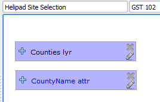

# GST 102: Spatial Analysis
## Lab 5 - Vector Data Analysis - Creating a Site Selection Model
### Objective – Using the QGIS Desktop Graphical Modeler to Perform a Site Selection Analysis

Document Version: 4/6/2015

**FOSS4G Lab Author:**
Kurt Menke, GISP  
Bird's Eye View GIS

**Original Lab Content Author:**
Richard Smith, Ph.D., GISP
Texas A&M University - Corpus Christi

---

The development of the original document was funded by the Department of Labor (DOL) Trade Adjustment Assistance Community College and Career Training (TAACCCT) Grant No.  TC-22525-11-60-A-48; The National Information Security, Geospatial Technologies Consortium (NISGTC) is an entity of Collin College of Texas, Bellevue College of Washington, Bunker Hill Community College of Massachusetts, Del Mar College of Texas, Moraine Valley Community College of Illinois, Rio Salado College of Arizona, and Salt Lake Community College of Utah.  This work is licensed under the Creative Commons Attribution 3.0 Unported License.  To view a copy of this license, visit http://creativecommons.org/licenses/by/3.0/ or send a letter to Creative Commons, 444 Castro Street, Suite 900, Mountain View, California, 94041, USA.

This document continues to be modified and improved by generous public contributions.

---

### 1 Introduction

In this lab you will learn how to streamline a workflow with a model. Using the QGIS Desktop Graphical Modeler, you will string tools together using the output of one operation as the input to the next. You can later edit model parameters and share it with others.

This lab includes the following tasks:

+ Task 1 Exploring the Data
+ Task 2 Creating the Model - Part 1
+ Task 3 Creating the Model - Part 2
+ Task 4 Creating the Model - Part 3

### 2 Objective: Understanding Basic Vector Analysis Using Overlays

The objective of this lab is for the student to learn how to conduct a site selection analysis using the QGIS Desktop Graphical Modeler.

### Task 1 - Exploring the Data

1. Open QGIS Desktop.
2. Add these five shapefiles from the lab directory to a new, blank, QGIS project:
	+ Airports
	+ Counties
	+ CityBoundaries
	+ Roads
	+ Water_features
3. Arrange the data layers so that points are on top of lines, which are on top of polygons. Move the CityBoundaries polygon layer above the Counties layer (reference figure below).

 

Clearly the data layers cover a variety of spatial extents. One likely step will be to Clip them so that they all cover the same spatial extent.

4. One item to check right away is the coordinate reference system of each layer. This is standard practice in any analysis. Open the Layer Properties for each layer and determine the coordinate reference system for each.

**Question # 1 – What is the coordinate reference system for these layers?**

Since they are all in the same coordinate reference system no re-projecting will be required. 

When building a site selection model, you are usually presented with a scenario. The scenario has parameters, which you will have to address to find the solution. The scenario below describes the parameters for the site selection you will do for this lab. The best method to solve a scenario like the one below is to extract the parameters from the description and write them down into verbal descriptions. Then from your descriptions you can transcribe them into GIS operations: buffer, intersect, =, <> etc..  

**Scenario**
A company is looking to lease a helipad at an airport for their company helicopter. This company is situated in Nueces County, Texas and wants the helipad to be within 3 miles of the Corpus Christi city limits, but not in the city limits. The pilots request that the airport or heliport be within a half mile of any source of water. It must also be within a mile from a County road.  As you have some knowledge of GIS you are being asked to find the best solution. 

7. Complete the table below. The first two entries in Description and Extent have been entered for you. Study the data layers in QGIS Desktop and complete the table. At that point you will have a better understanding of what you have to work with.

**Data Layer  --  Description and Extent**

Airports  --  Airports, Airfields, Heliports of Texas

City Boundaries  --  City Limits of Populated Areas of Texas

Water Features  --  

Counties  --  

Roads  --  

8. The next step is to think about the site selection analysis. Read the Scenario carefully and think about the steps required to finish it. The first two GIS Operations have been worked out for you (shown below). Complete the rest of the GIS Operations from the Scenario description. If there is a selection involved open the attribute table and determine what the field name will be and what value you will be selecting for.

**Scenario Parameter  --  GIS Operations**

Scenario Parameter  --  Select Nueces County from USA Counties and Save as a new shapefile. Attribute column = County. Value = Nueces

Airports of the USA  -- Clip to Nueces County

Must be within 3 miles of Corpus Christi city limits but not inside city limits  --  Select by Attributes Corpus Christi from CityBoundaries of Texas. The attribute column = Name. Value = Corpus Christi. Buffer 3 miles around the Corpus Christi City limits. Use the Difference tool to erase the Corpus Christi boundary from the buffer.

Must be within half a mile of water  ==  

Must be within a mile of a County road.

9. Save your project as Lab 5.qgs in the lab data directory.

### Task 2 - Creating the Model - Part 1
Now you understand the data you have to work with. You also know that you will have to determine which airports meet the criteria laid out in the completed table above. The next task is to begin building the model.

1. Open QGIS Desktop and open Lab 5.qgs if it is not already.

2. From the menu bar choose Processing | ToolBox.

Notice at the bottom of the ToolBox panel that there is a toggle between a Simplified and Advanced Interface to the Toolbox. All the tools are available, no matter which view you choose. However, this setting will determine the view of geoprocessing algorithms in the Graphical Modeler as well.

3. For purposes of this lab, choose the Advanced interface.

In the Process Toolbox, there is a default folder for Models, and if saved there, they will show up as models in Toolbox | Models. You can set the location of this default folder.

4. From the menu bar choose Processing | Options.
5. Expand the Models section.
6. Double-click the Models folder and an ellipsis button will appear to the right.
7. Click on the ellipsis button, navigate to the Lab 5 Data folder, create a new subfolder named 'MyData', and click Select the new folder (shown in figure below).

8. Click OK to close the Processing options.

4. From the menu bar now choose Processing | Graphical Modeler.

The Graphical Modeler (also known as the Processing modeler) allows you to create complex models using an intuitive graphic interface. When working with a GIS, most analysis operations are not isolated, but rather part of a chain of operations. Using the Graphical Modeler, that chain of processes can be incorporated into a single process. This allows you to run the entire analysis as a single operation. It also allows you to execute the same model on a different set of inputs! No matter how many steps and different operations it involves, a model is executed as a single operation, thus saving time and effort, especially for larger models.

The left hand panel has two tabs Inputs and Algorithms. The model itself will be designed in the right hand window.

5. At the top of the main design window are two text fields: [Enter model name here] and [Enter group name here]. Name the model Helipad Site Selection and the Group GST 102 (shown in figure below).

6. Next you will save your model. Click the Save button. It should now open a Save Model dialog and default to the MyData folder.
7. Name it HelipadSelection.model and click Save. It will be saved as a .model file. You should receive the Model was correctly saved message. Click OK.

The first analysis step will be to create your study area boundary. This will involve creating a Nueces County shapefile from the USA wide Counties layer.

7. The first step in creating a model is to define the inputs. All of your data is vector data. Click on the Inputs tab to the Graphical Modeler and double-click on Vector layer.

The Parameter definition window opens. Here you are simply defining the conceptual parameter. You will not actually connect it to the GIS data layer until you are ready to run the model.

8. Name the parameter Counties lyr. *Note*: The lyr will be your naming convention for parameters, which are GIS layers. Other parameters will be attributes. 
9. Set the Shape type to Polygon.
10. Set the Required parameter to Yes. If your Parameter definitions look like the figure below, click OK.

The Counties lyr parameter will now appear in the design window (shown in figure below).

9. The next input parameter will be a Table field. Double-click on Table field.
10. Set the Parameter name to CountyName attr and the Parent layer to Counties lyr. *Note*: Ending the name with ‘attr’ will be the naming convention for Table field Inputs.
10. If your Parameter definitions look like the figure below, click OK.

10. Drag the CountyName attr input so that it is below Counties lyr (shown in figure below). You can arrange the model elements into an attractive and intuitive flow.

11. Now you will add the Extract by attribute algorithm. Click on the Algorithms tab. It looks a lot like the Toolbox.
12. Double-click on QGIS geoalgorithms | Vector selection tools | Extract by attribute. The Extract by attribute window opens Fill it out as follows (reference figure below):

	a. Input layer = Counties lyr

	b. Selection attribute = CountyName attr

	c. Operator = =

	d. Value (Refer to your notes in the table above)

*Note:* It will not need quotes, just type it in as it appears in the attribute table.

	e. Output<OutputVector> = NuecesCounty

*Note:* There is a slight difference here between a Graphical Modeler tool and a standard Toolbox tool. Here the output can be saved as a temporary file that will be used as input to the next algorithm, or it can be saved to a permanent layer that you will specify when you run the model. Typing in anything in this space tells the Modeler that this output will be saved. The text you supply will be the description for the output when executing the model. You will choose the actual name of the shapefile and its location when you execute the model. Since you may want the Nueces County boundary for cartographic reasons you will choose to save it as a layer.

13. Click OK to set the parameters for the Extract by attribute algorithm.

The first complete algorithm has been added! You can drag the parameter boxes to arrange them as you would like and the connecting arrows will follow (example in figure below). You can also click on the Edit button   on any model parameter at any time. This will reopen the algorithm window or model parameter window From there you can make changes if necessary.

13. Save the model and close the Graphical Modeler window.
14. From the Processing Toolbox panel, expand Models | GST 102. There is your model (shown in figure below).

Your model is obviously not yet complete. However, it is already a geoprocessing tool that you can open, set parameters for, and run. Let's try the model out to see what happens with its current configuration.

15. Double-click on the Helipad Site Selection model in the Processing Toolbox to open the model as a tool.
16. Set Counties lyr to Counties, CountyName attr to COUNTY and keep Nueces County as a temporary file for now (Don’t fill it in!) (reference figure below).

17. Click Run. The temporary NuecesCounty layer will be added to QGIS Desktop. Zoom in and verify that Nueces county was correctly selected using the tooo.
15. For now, remove this layer from QGIS Desktop and then save your QGIS project.

### Task 3 - Creating the Model - Part 2

Now that your basic model is set up, you will add additional functionality to it. In this task you will work on geoprocessing the data for the CityBoundaries, Roads, and Water_features layers. You will also clip the airports to Nueces County.

1. Open QGIS Desktop and open Lab 5.qgs if it is not already.
2. From the menu bar now choose Processing | Graphical Modeler.
3. Once the Graphical Modeler opens, click the Open Model   button and open the Helipad Site Selection model (if it isn't already open). 

3. Now you will add a parameter for Airports. Click the Vector layer input parameter and fill out the Parameter definition as in the figure below.

4. You will clip Airports with the Nueces County layer. Click on the Algorithms tab and select QGIS geoalgorithms | Vector overlay tools | Clip. The Clip tool will open.
5. Set the Input layer to Airports lyr and the Clip layer to 'Output' from algorithm 'Extract by attribute' (reference figure below).

Your model should now resemble the figure below.

Now you will work with the CityBoundaries. This is the most involved parameter because the site must be both within 3 miles of Corpus Christi and beyond the Corpus Christi city limits.

6. Add a Vector layer Input for CityBoundaries

	a. Parameter name = CityBoundaries lyr

	b. Shape type = Polygon

	c. Required = Yes

	d. Click OK

	e. Situate it below the Airport lyr

7. You will need to do an Extract by attribute on CityBoundaries in order to extract the Corpus Christi boundary. Therefore, you will need another Table field attribute. Click on Inputs tab and choose Table field.

	a. Parameter name = CityBoundaries attr

	b. Parent layer = CityBoundaries lyr

	c. Click OK

	d. Situate it below the CityBoundaries lyr

8. Add another Extract by attribute algorithm to the model with the following parameters:

	a. Description = Extract city boundaries by attribute

	b. Input layer =  CityBoundaries lyr

	c. Selection attribute = CityBoundaries attr

	d. Operator = =

	e. Value = Corpus Christi

	f. Output = leave blank

	g. Click OK

9. The next step for processing the CityBoundary site selection parameter is to buffer the Corpus Christi layer by 3 miles. Click on the Algorithms tab and choose QGIS geoalgorithms | Vector geometry tools | Fixed distance buffer. Use the following parameters:

	a. Input layer = 'Output' from algorithm 'Extract city boundaries by attribute'

	b. Distance = 4828.03 (3 miles in meters; we are using meters since the data is in UTM meters)

	c. Segments = 5

	d. Dissolve result = Yes

	e. Buffer<OutputVector> - leave blank

	f. Click OK

The last parameter detail related to the boundary of Corpus Christi is that the airport needs to be located outside the city limits. Therefore, you need to take the 3 mile buffer output, and run a Difference algorithm on it, with the Corpus Christi output as the Difference layer. This will take the buffer and erase from it the portion within the city limits, leaving a 3 mile ring around the city limits.

10. Click on the Algorithms tab and choose QGIS geoalgorithms | Vector overlay tools | Difference. Use the following parameters:

	a. Input layer = 'Buffer' from algorithm 'Fixed distance buffer'

	b. Difference layer = Output form algorithm 'Extract' city boundaries by attribute'

	c. Difference<OutputVector> - leave blank

	d. Click OK.

Your model should now resemble the figure below.

Now you will work on the Roads parameter. First, the County roads will be selected. Then those County roads will be buffered by one mile

12. Add a Vector layer input for Roads with the following parameters:

	a. Parameter name = Roads lyr

	b. Shape type = Line

	c. Required = Yes

	d. Situate it below the CityBoundaries attr input

	e. Click OK.

13. Add a Table field input with the following parameters:

	a. Parameter name = Roads attr

	b. Parent layer = Roads lyr

	c. Situate it below the Roads lyr

	d. Click OK

14. Add another Extract by attribute algorithm to the model with the following parameters:

	a. Description = Extract roads by attribute

	b. Input layer =  Roads lyr

	c. Selection attribute = Roads attr

	d. Operator = =

	e. Value = C

	f. Output = leave blank

	g. Click OK

15. Now you will buffer the County roads by one mile. Add another Fixed distance buffer algorithm and use the following parameters:

	a. Description = Fixed distance buffer for roads

	b. Input layer =  Output from algorithm 'Extract roads by attribute'

	c. Distance = 1609.34 (1 mile in meters)

	d. Segments = 5

	e. Dissolve result = Yes

	f. Buffer<OutputVector> - leave blank

	g. Click OK

Your model should now resemble the figure below.

The last parameter to address the distance to Water Features which be buffered by 0.5 miles.

17. Add a Vector layer input for WaterFeatures with the following parameters:

	a. Parameter name = Water lyr

	b. Shape type = Line

	c. Required = Yes

	d. Situate it below the Roads attr input

	e. Click OK.

18. Now you will buffer the Water Features by 0.5 miles. Add another Fixed distance buffer algorithm and use the following parameters:

	a. Description = Fixed distance buffer for water

	b. Input layer =  Water lyr

	c. Distance = 804.67 (0.5 miles in meters)

	d. Segments = 5

	e. Dissolve result = Yes

	f. Buffer<OutputVector> - leave blank

	g. Click OK

Your model should now resemble the figure below.

20. Save the model.

### Task 4 - Creating the Model - Part 3

In this final task, you will combine all the individual parameters into one layer representing the combination of all parameters. This will represent the acceptable area for helipad locations. Then you will run a clip algorithm on airports to determine which airports meet all the criteria.
 
1. Open QGIS Desktop and open Lab 5.qgs if it is not already.
2. From the menu bar now choose Processing | Graphical Modeler. Once the Graphical Modeler open click the Open Model  button and open the Helipad Site Selection model.

You can combine the water buffer, county roads buffer and the 3 mile ring around Corpus Christi using the Intersect algorithm. This will compute the area of overlap between the three layers.

3. Click on the Algorithms tab and choose QGIS geoalgorithms | Vector overlay tools | Intersection. Use the following parameters:

	a. Input layer = 'Difference' from algorithm 'Difference'

	b. Intersect layer = 'Buffer' from algorithm'Fixed distance buffer for roads'

	c. Intersection<OutputVector> - leave blank

	d. Since we need to Intersect more than two layers, we need to set two parent algorithms. Click the ellispsi button for the Parent algorithsm parameter. When the Multiple Selection window opens check the bottom two Fixed distance buffer representing the roads and water buffers (reference figure below).

4. Click OK to set the Multiple Selection.
5. Click OK to set the Intersection parameters.

The model will now look like the figure below with the Intersect algorithm taking all three inputs.

5. Finally, you will clip the airports with the output of the Intersect giving you the final solution. Click on the Algorithms tab and choose QGIS geoalgorithms | Vector overlay tools | Clip. Use the following parameters:

	a. Input layer = 'Clipped' from algorithm 'Clip'

	b. Clip layer = 'Intersection' from algorithm 'Intersection'

	c. Intersection<OutputVector> - Final Solution

The final model should resemble the figure below.

*Note on the Final Clip Algorithm*: At this time, there is a new bug that may prevent the final clip from working in the model. The error will be reported in the Log tab on the final step in red and it will read: *Error executing algorithm 9 [Errno 9] Bad file descriptor See log for more details.* This bug is not present on all installations and all platforms. If you don’t get this you can ignore this note. However, if you receive this error, simply end the model with the Intersection, and save out the output of the Intersection to your MyData folder. You can then perform the final clip manually.

7. Save the Model and Close it.
8. Congratulations! You have created your first geoprocessing model!
9. From the Toolbox panel, expand Models | GST 102. 
10.	Double click on Helipad Site Selection. Fill out all the parameters as shown in the figure below. Click Run when ready.

If the model ran correctly, the FinalSolution layer should contain Cuddihy Field as the only selected airport (shown in figure below).

*Note on Running Models*: Models can also be run from the Graphical Modeler interface. You can click the Run model  button. You will be prompted to Save the model, then you will be presented with the same model window shown in the figure below.

*Note on Debugging Models*: Here we have written out the vast majority of outputs to temporary files. If you get an error or an incorrect result, it can be helpful to save out questionable intermediate datasets. For example, say you are getting an error or an unexpected result from a buffer operation. Try outputting the result of the Extract by attribute dataset that feeds into the buffer algorithm. This will let you determine if the prior step is working correctly. To do this all you have to do is enter a name for the output in question like you did for Nueces County and the Final Solution.

### 3 Conclusion
In this lab you have been exposed to both site selection modeling and the use of Graphical Modeler in building a workflow. Building the model is certainly time consuming. However, the benefits are many, especially if this is a workflow you will have to perform many times. 

By clicking on the Export as image button 
  in the Graphical Modeler you can export the model to a graphic. This graphic can then be included in a report or a presentation. This can help you explain the technical workflow to others.

If the client changed their mind on the distance from Corpus Christi, you could simply adjust that buffer distance in the model, and re run it to see how the solution changed. Without the model, you would be starting from scratch in this scenario. 

This model can now be run against similar set of data at a different site such as Seattle or Boston. If you were to run it against another set of data, some of the parameters of the Extract by attribute would have to be edited. However, that is easily done. Models allow you to streamline big workflows.

### 4 Discussion Questions

1. How does Graphical Modeler make spatial analysis easier?
2. Export your model as a graphic and turn in with your lab.

### 5 Challenge Assignment (optional)

The client has decided that they can expand the Corpus Christi parameter from 3 miles to 3.5 miles. Edit the buffer distance in the model for the Corpus Christi buffer and determine how that changes the number of airports meeting their needs. Make a map of each scenario to show the client. You may want to output some intermediate datasets such as the Intersection or Buffers to be able to show these criteria on your maps.