# GST 102: Spatial Analysis
## Lab 6 - Vector Data Analysis - Network Analysis
### Objective – Learn the Basics of Network Analysis

Document Version: 9/23/2014

**FOSS4G Lab Author:**
Kurt Menke, GISP  
Bird's Eye View GIS

**Original Lab Content Author:**
Richard Smith, Ph.D.  
Texas A&M University - Corpus Christi

---

Copyright © National Information Security, Geospatial Technologies Consortium (NISGTC)

The development of this document is funded by the Department of Labor (DOL) Trade Adjustment Assistance Community College and Career Training (TAACCCT) Grant No.  TC-22525-11-60-A-48; The National Information Security, Geospatial Technologies Consortium (NISGTC) is an entity of Collin College of Texas, Bellevue College of Washington, Bunker Hill Community College of Massachusetts, Del Mar College of Texas, Moraine Valley Community College of Illinois, Rio Salado College of Arizona, and Salt Lake Community College of Utah.  This work is licensed under the Creative Commons Attribution 3.0 Unported License.  To view a copy of this license, visit http://creativecommons.org/licenses/by/3.0/ or send a letter to Creative Commons, 444 Castro Street, Suite 900, Mountain View, California, 94041, USA.  

This document was original modified from its original form by Kurt Menke and continues to be modified and improved by generous public contributions.

---

### 1. Introduction

In this lab, you will learn how to conduct analyses related to linear networks. You will learn how to determine the shortest path from origin to destination and how to allocate a linear network into service areas.  
  
This lab includes the following tasks:

+ Task 1 Basic Network Analysis
+ Task 2 Allocating Service Areas

### 2 Objective: Learn the Basics of Network Analysis

The objective of this lab is for the student to learn how to conduct basic network analysis. You will use the Road Graph plugin to QGIS Desktop, and you will be introduced to the GRASS plugin. You will use some of the networking tools in GRASS to allocate service areas.

### 3 How Best to Use Video Walk Through with this Lab

To aid in your completion of this lab, each lab task has an associated video that demonstrates how to complete the task.  The intent of these videos is to help you move forward if you become stuck on a step in a task, or you wish to visually see every step required to complete the tasks.

We recommend that you do not watch the videos before you attempt the tasks.  The reasoning for this is that while you are learning the software and searching for buttons, menus, etc…, you will better remember where these items are and, perhaps, discover other features along the way.  With that being said, please use the videos in the way that will best facilitate your learning and successful completion of this lab.

### Task 1 Basic Network Analysis

In this task, you will use the Road Graph plugin to determine the shortest distance between two points via a San Francisco streets layer. You will do this both by shortest overall distance and by time traveled.

2.	Open QGIS Desktop 2.4.0
3.	Add the MTA_DPT_SpeedLimits shapefile to QGIS Desktop.
4.	Right click on the layer and choose Set project CRS from layer from the context menu.

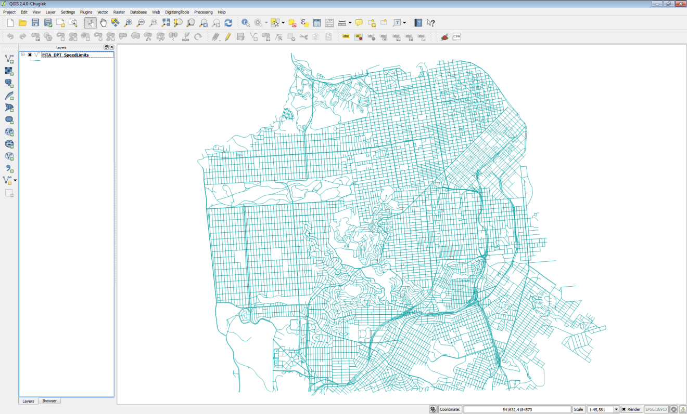

5.	This is a street network for the City of San Francisco. Open the attribute table to see what kind of data you have to work with. Notice that in addition having the street name and type, there is a column populated with speed limits for each road segment. Close the attribute table.
6.	Open the Layer Properties-> Style and symbolize the data by speed limit. 

	a.	Choose a Categorized renderer

	b.	Column = speedlimit

	c.	Color ramp = Greys

	d.	Click Classify

	e.	Click OK (figure below)

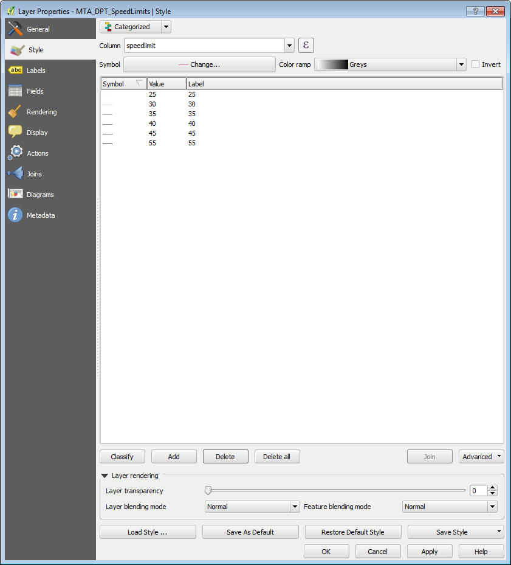

7.	Your map should resemble the figure below.You can now distinguish the major arteries.

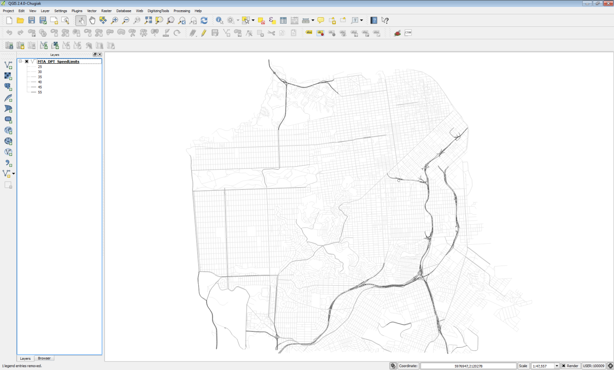

8.	Save your map as Lab 6.qgs.
9.	You will use the QGIS Road Graph plugin to find the shortest distance between two points on the network. From the menu bar choose Plugins -> Manage and Install Plugins. Select the All tab, and type Road into the Search bar. Check the box next the Road graph plugin to enable it (figure below). Click Close. 

10.	A new panel for this plugin will appear below the Table of Contents. 
11.	Before you begin you need to configure the plugin. From the menu bar, choose Vector -> Road Graph-> Settings. The Road Graph settings window opens. Choose the following settings (figure below):

	a.	Time unit: hour

	b.	Distance unit: kilometer

	c.	Topology tolerance: 10

	d.	Layer: MTA_DPT_SpeedLimits

	e.	Direction field: Always use default

	f.	Speed field: speedlimit

	g.	Click OK.

12.	Now you will populate the Road Graph plugin panel (below the Table of Contents). Click the Start location   button and click on a spot on the map. Do the same for the Stop location via the Stop location button. Small dots will appear where you have clicked.
13.	Set the Criterion as Length. Now click Calculate to find the shortest path between the two points. After some processing, a red line will appear as the solution (figure below). 

14.	To save the shortest path click the Export button. Choose New temporary layer as the Select destination layer. Click OK. The shortest path will now appear in your Table of Contents. 
15.	To make this layer permanent right click on it and choose Save as…  Save the data to a shapefile in the Lab 6/Data folder named ShortestPath.shp (figure below

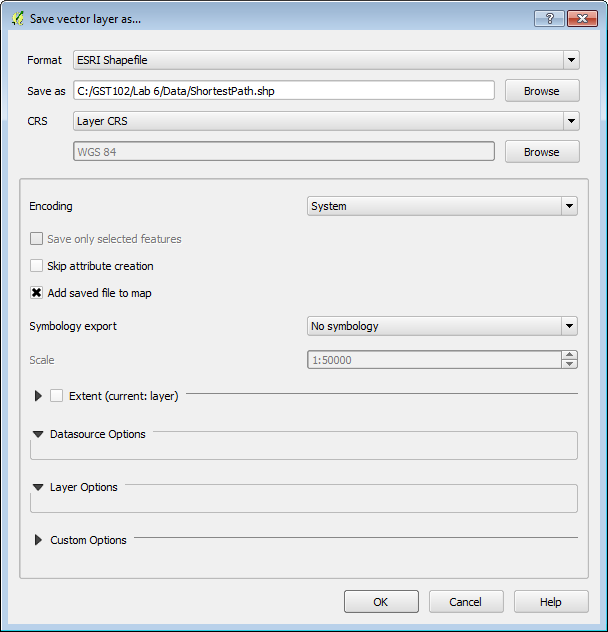

16.	Now you will determine the shortest drive time between the two points. Change the Criterion to Time. Click Calculate. With this Criterion, you may get a very different solution, depending on the points you chose.
17.	Click Export to save this layer to a New temporary layer, and again, save that temporary out to a shapefile. Name this file FastestRoute.shp
18.	Remove the temporary layers from the map, leaving just the street network and two solutions. Style the ShortestPath layer as a red line with a thickness of 0.46 and the FastestRoute layer with a dark blue line of equal thickness. With the points I chose, I had two very different solutions (figure below).

19.	Save your map file and close QGIS Desktop.

### Task 2 Allocating Service Areas
Now you will use some GRASS tools to allocate portions of the road network served by each San Francisco Police Station. GRASS is a mature and powerful FOSS GIS software package. It has a unique data structure that can be initially intimidating. Fortunately, QGIS Desktop has a GRASS plugin that provides a much more intuitive interface to the large suite of GRASS analysis tools. 

1.	Open QGIS Desktop 2.4.0 and open Lab 6/Data/Lab6_Task2.qgs
2.	
2.	This project has three layers loaded: SF_Police, SF_FireStations and SF_Streets.

GRASS uses its own file format. These layers are stored in a GRASS Database, which is essentially a folder with containing GRASS data. The Grass Database is Lab 6/Data/GRASSdb. These data sets have been imported into GRASS from shapefiles. In QGIS Desktop they will behave just like any other layer. However, since they are stored as GRASS Vectors, you can also use the suite of GRASS tools with them. These tools include a set for network analysis.

3.	First, you will enable the GRASS plugin. From the menu bar choose Plugins -> Manage and Install plugins.  The GRASS plugin is a core QGIS plugin. This means it is already installed and all you need to do is enable it. Click on the Installed tab. Find GRASS and check the box to turn it on. Click Close when done. 
4.	Enabling GRASS turns on a new toolbar (below).
 

The data is already set up for you in this QGIS Desktop project. The following is simply an explanation to get you oriented to the GRASS data structure. Remember GRASS data is stored in a GRASS database, which again is simply a folder. Inside the database will be folder(s) called Locations and inside a Location will be folder(s) called Mapsets. 

GRASSdb -> Locations->Mapsets

Locations represent a certain spatial extent and coordinate reference system that you identify when you create one. Mapsets are a way to organize data and are the data tier that actually contains data layers. Every Location contains a default Mapset named PERMANENT. Additional Mapsets can be set up for individual users (Tom, Mary, Alice etc,) or for categories of data such as hydrology, transportation, boundaries etc. 
To begin working with the GRASS tools you need to have a GRASS Mapset open. 

This QGIS project has three data layers from a GRASS Database however, you need to open a Mapset to begin working with GRASS tools. Additionally, the Mapset you have open determines where your outputs will be saved. For this lab there is an empty Mapset called MyData that you will open to complete Task 2. 

5.	 From the GRASS toolbar, click on the Open Mapset 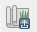  button. Fill out the Select GRASS Mapset window as in the figure below.
 
	a.	The Gisdbase should be: Lab 6\Data\GRASSdb

	b.	Location: Lab6_SanFrancisco

	c.	Mapset: MyData

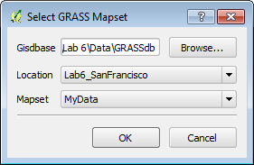

6.	There will be two changes that occur. 1) You will see a red box appear around your data on the map. This represents the Region of study (figure below), which in this case is equal to the Location settings. It is the spatial extent of your study area. 2) The remainder of the buttons on the GRASS toolbar are now active.

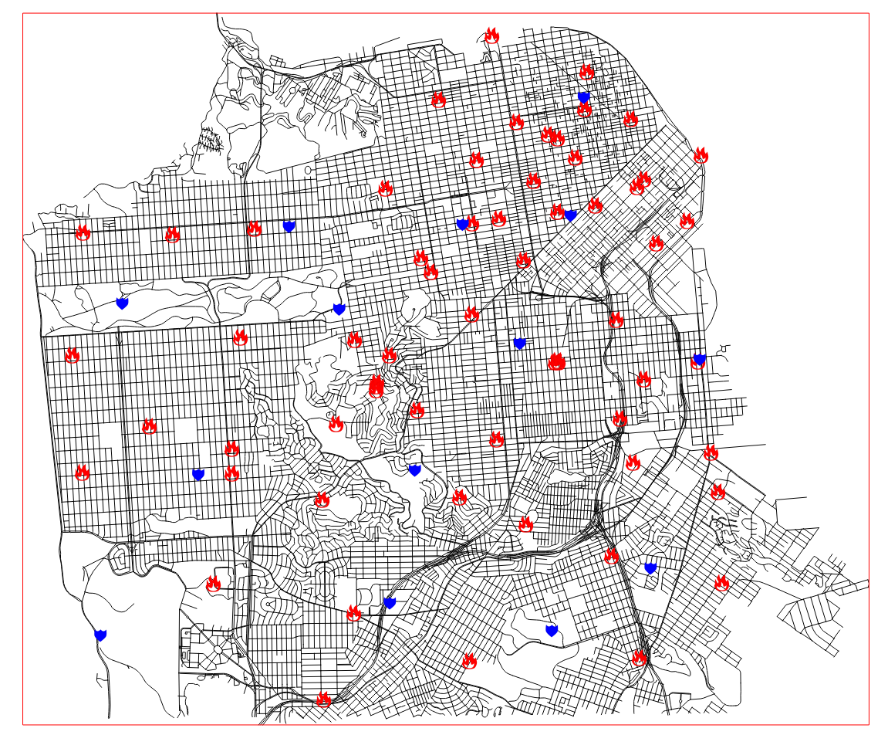

7.	Click the Open GRASS Tools   button.
8.	The GRASS Tools window opens. This is the interface to all the GRASS geoprocessing tools. Notice that in the title bar of the window it displays your Location/Mapset (Lab6_SanFrancisco/MyData) (figure below)

The GRASS Tools window has three tabs: Modules Tree, Modules List and Browser. The Modules Tree allows you to access GRASS tools organized by theme. The Modules List has all the same tools, but they are listed alphabetically with a search bar. The Browser allows you to see what layers you have in your open Mapset. You do not yet have data in your MyData Mapset so there will be nothing yet to see

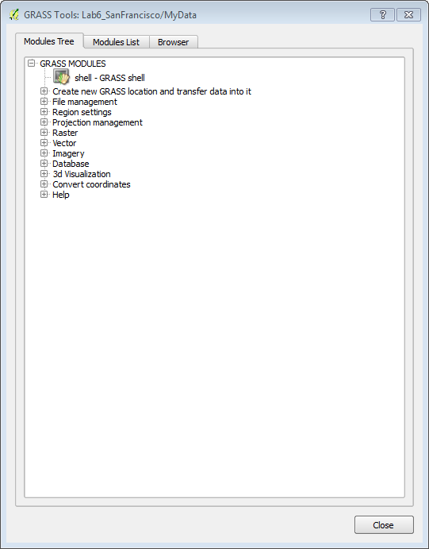

9.	The first step in doing a network analysis in GRASS is the build a network dataset. Expand Vector->Spatial Analysis -> Network analysis-> v.net (figure below). This tool will create a linear network of San Francisco streets and attach nodes representing the Police stations.

10.	Double click on the v.net – Network Maintenance tool. The tool opens as an addition tab on the window to the right of Browser. Additionally, the tool itself has three tabs. Options, Output and Manual. The Options tab is where you fill out your parameters before running the tool. When you run the tool, it will switch to the Output tab and you will see details about the running process. The Manual tab is help for the tool. Fill it out as described below and in the figure below. 
**NOTE:** The inputs are listed as LayerName@Mapset.

	a.	Name of input vector map: SF_Streets (SF_Streets@PERMANENT 1 line)

	b.	Name of input point vector map: SF_Police ( SF_Police@PERMANENT 1 point)

	c.	Operation to be performed: Connect still unconnected points to vector network by inserting new line(s)

	d.	Arc layer: 1

	e.	Node layer: 2

	f.	Threshold: 300

	g.	Name for output vector map: SF_Network

	h.	Click Run

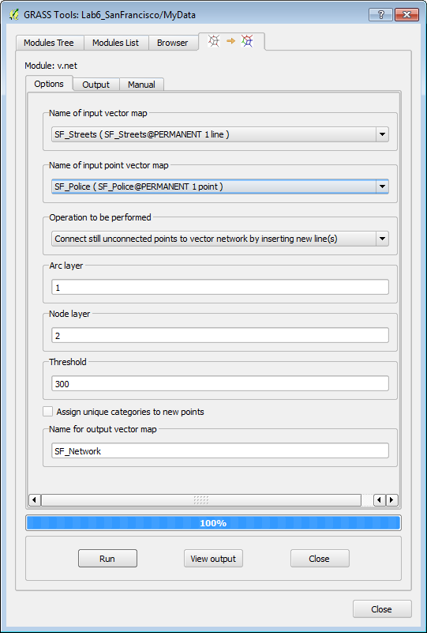

11.	While running the Output tab will be visible (figure below). Click the View output button to add the network dataset to QGIS.

12.	For now, leave the GRASS tools window open. You may want to move it to the side so you can see the map.
13.	Turn off the SF_FireStations and SF_Police layers.
14.	In addition to the linear network, this operation produced nodes for each police station point. The View output only added the linear network to QGIS, so you will now add the network nodes to QGIS. On the GRASS toolbar click the Add GRASS Vector Layer 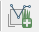  button.
15.	The Select GRASS Vector Layer window opens. Under Mapset: MyData, Map name SF_Network choose 2_point (figure below). _Remember when you ran the v.net tool you specified that the ID for the Arc layer was 1 and the node layer 2._

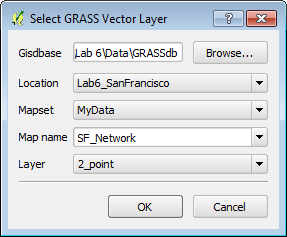

16.	Open the attribute table for the SF_Network_2 node layer. It has one column named cat with values for each of the 14 police stations (1-14). Close the table.
17.	Now that the network dataset is constructed, you will identify the road territory that each police station should serve. In the GRASS Tools window switch back the Modules Tree tab. Click on v.net.alloc – Allocate Network tool. The tool will open in yet another tab.
18.	Fill out the tool form as described below and as seen in the figure below.
	
	a.	Input arcs: SF_Network ( SF_Network@MyData 1 line)

	b.	Input nodes: SF_Network 2 ( SF_Network@MyData 2 point)

	c.	Cats: 1,2,3,4,5,6,7,8,9,10,11,12,13,14   _NOTE: these are the values for each police station from the SF_Network_2 node attribute table._

	d.	Name for output vector map: PoliceSt_Allocation

19.	When the tool is set up correctly, click Run. When complete click View output.
20.	Open the attribute table for the PoliceSt_Allocation layer. Notice that it simply has the cat ID of each of the 14 police stations. 
21.	Before you close the GRASS Tools window switch to the Browser tab. Click the Refresh   button. Expand MyData->Vector and PERMANENT->Vector. You will see the data layers listed in each Mapset (figure below). 

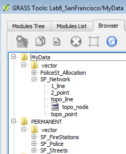

22.	Now click on the SF_Network layer and you will see some metadata in the right hand window (figure below). This is the command line equivalent of the tool parameters you used. This can be helpful when trying to remember how you created a given layer. 

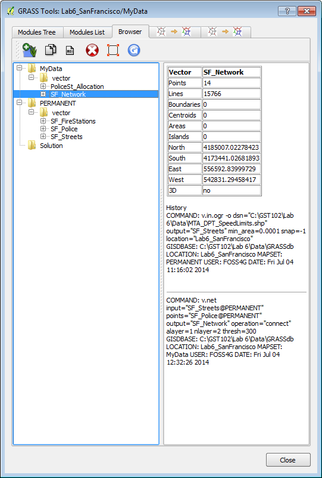

23.	Close the GRASS Tools window.
24.	To see the results of your analysis you will Style the PoliceSt_Allocation layer. Open the Layer Properties -> Style tab. Choose the following parameters:

	a.	Renderer: Categorized

	b.	Column: cat

	c.	Color ramp: Random colors

	d.	Click Classify

	e.	Click OK

25.	Now turn OFF the SF_Network 2 layer and turn ON the SF_Police layer. 
26.	Next you will label the Police stations with their name. Open the Layer Properties->Labels tab for the SF_Police layer. 

	a.	Check the Label with layer with box

	b.	Choose FACILITY_N as the attribute column

	c.	Click the Text tab below and  make the font size 9 and Bold

	d.	Click the Buffer tab and click Draw text buffer and make the size 2

	e.	Click OK.

27.	Your map should resemble the figure below.

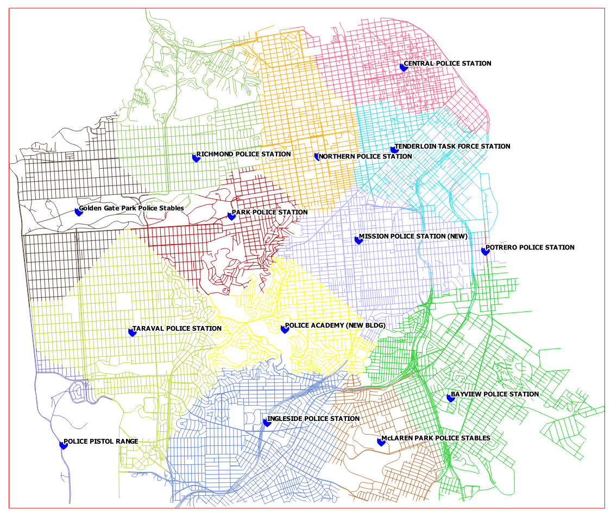

### 5 Conclusion
In this lab, you were exposed to basic network routing and allocation analysis. You calculated the shortest distance between two points via both time and distance. You then determined which portions of the network that should be allocated to each police station. There are many applications for this type of analysis including emergency management, parcel delivery, and general navigation. 

### 6 Discussion Questions

1.	What is a real world application of network analysis? Explain.
2.	How can a network analysis benefit the logistics industry?
3.	What other linear networks could this apply to other than roads?

### 7 Challenge Assignment

The San Francisco Police Department has shown your analysis to their colleagues at the Fire Department and they were impressed. Now the Fire Department would like the same analysis done for their stations. In the PERMANENT mapset there is a SF_FireStations GRASS vector layer. Repeat the steps in Task 2 to create the same allocation analysis for the Fire Department. Compose a map of the results of the Fire Department analysis.
