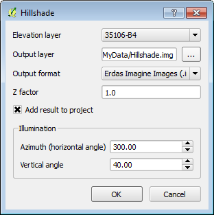
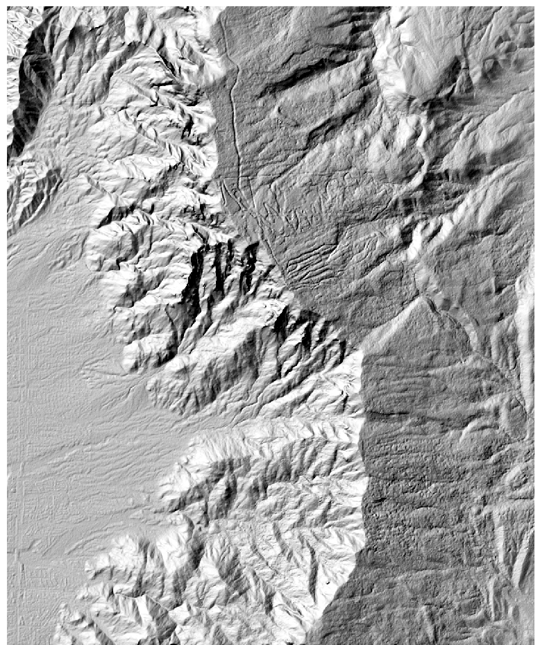
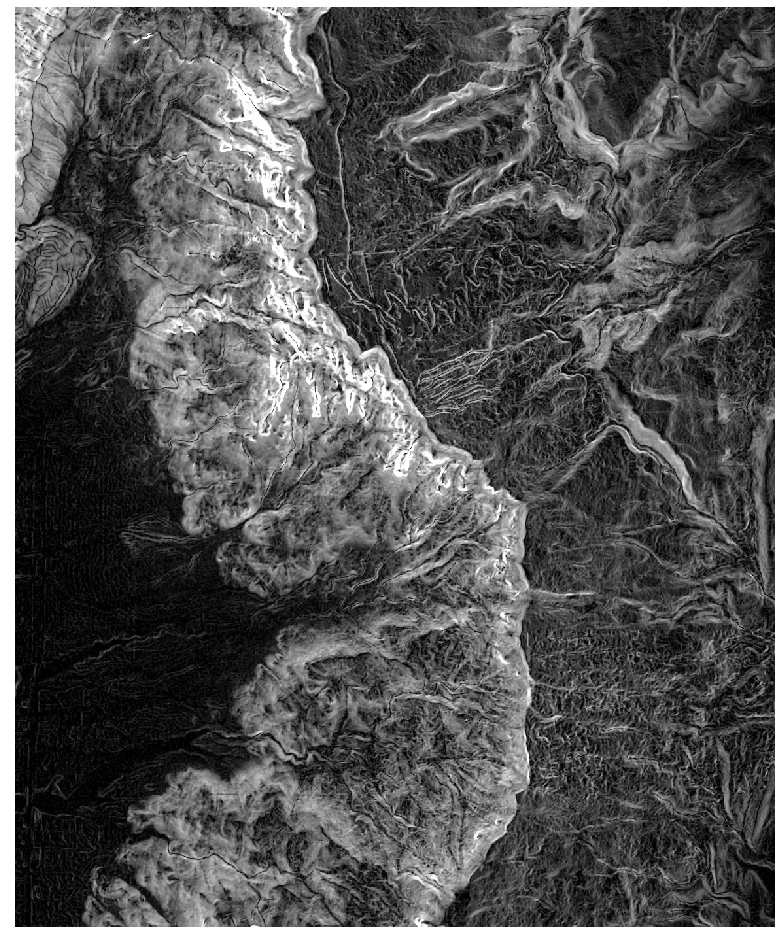
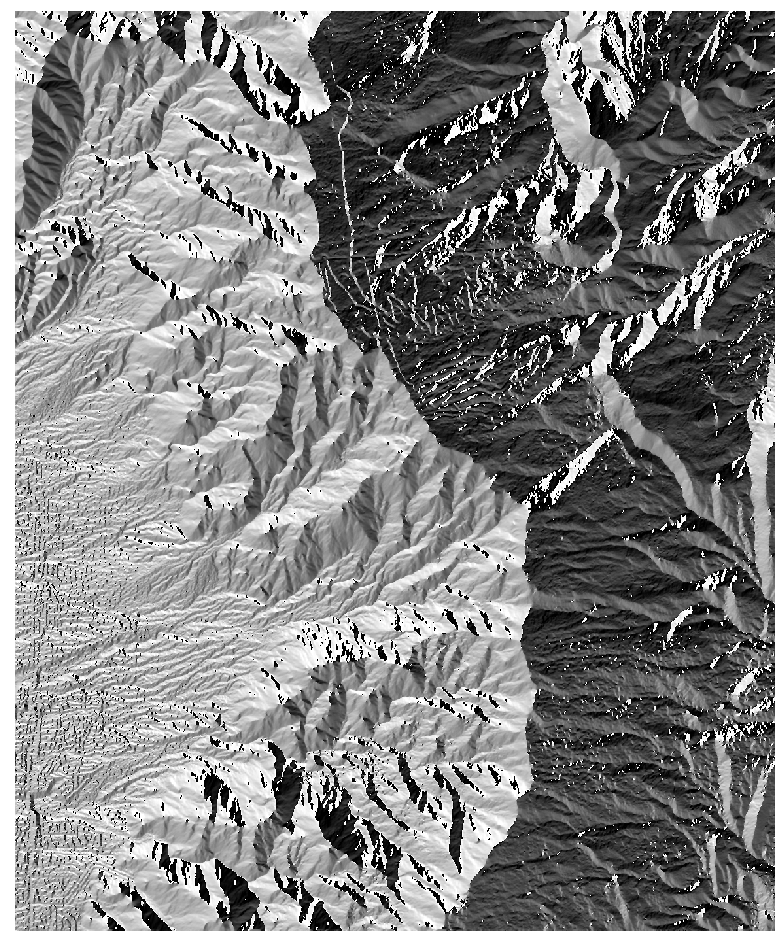
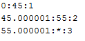
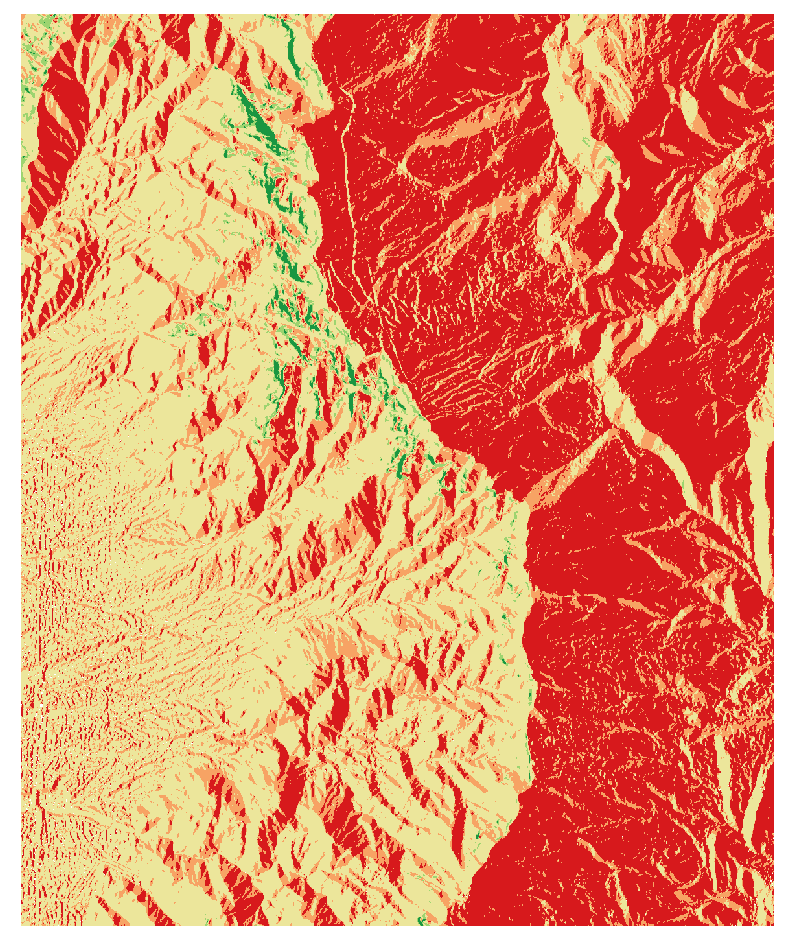

# GST 102: Spatial Analysis
## Lab 7 - Raster Data Analysis - Working with Topographic Data
### Objective – Learn the Basics of Terrain Analysis

Document Version: 9/23/2014

**FOSS4G Lab Author:**
Kurt Menke, GISP  
Bird's Eye View GIS

**Original Lab Content Author:**
Richard Smith, Ph.D.  
Texas A&M University - Corpus Christi

---

Copyright © National Information Security, Geospatial Technologies Consortium (NISGTC)

The development of this document is funded by the Department of Labor (DOL) Trade Adjustment Assistance Community College and Career Training (TAACCCT) Grant No.  TC-22525-11-60-A-48; The National Information Security, Geospatial Technologies Consortium (NISGTC) is an entity of Collin College of Texas, Bellevue College of Washington, Bunker Hill Community College of Massachusetts, Del Mar College of Texas, Moraine Valley Community College of Illinois, Rio Salado College of Arizona, and Salt Lake Community College of Utah.  This work is licensed under the Creative Commons Attribution 3.0 Unported License.  To view a copy of this license, visit http://creativecommons.org/licenses/by/3.0/ or send a letter to Creative Commons, 444 Castro Street, Suite 900, Mountain View, California, 94041, USA.  

This document was original modified from its original form by Kurt Menke and continues to be modified and improved by generous public contributions.

---

### 1. Introduction

In this lab, you will learn about topographic data and how to use it for analysis. You will learn how to create datasets such as slope, hillshades using QGIS Desktop. You will then learn how to combine them using raster algebra.     
This lab includes the following tasks:

+ Task 1 Terrain Analysis
+ Task 2 Reclassification
+ Task 3 Raster Calculator

### 2 Objective: Learn the Basics of Terrain Analysis

The objective of this lab is to learn the basics of terrain analysis using QGIS Desktop. 

### 3 How Best to Use Video Walk Through with this Lab

To aid in your completion of this lab, each lab task has an associated video that demonstrates how to complete the task.  The intent of these videos is to help you move forward if you become stuck on a step in a task, or you wish to visually see every step required to complete the tasks.

We recommend that you do not watch the videos before you attempt the tasks.  The reasoning for this is that while you are learning the software and searching for buttons, menus, etc…, you will better remember where these items are and, perhaps, discover other features along the way.  With that being said, please use the videos in the way that will best facilitate your learning and successful completion of this lab.

### Task 1 Terrain Analysis

In this task, you will use a digital elevation model to create several terrain related datasets: slope, aspect and hillshade. These elevation derived datasets can be important in site selection and other terrain based spatial analyses.

2.	Open QGIS Desktop 2.4.0.
3.	Add the 35106-B4.dem raster to QGIS Desktop using the Add Raster Layer   button. This raster layer has elevation values for each cell. This type of data is referred to as a digital elevation model, or DEM, for short. This particular dataset covers the Sandia Mountains on the east side of Albuquerque, New Mexico (figure below). The light areas have the highest elevation and the dark areas the lowest elevation.

_QGIS_Desktop.png "Digital Elevation Model (DEM) QGIS Desktop") 

4.	Now you will learn about your dataset.
	
	a.	Open the Layer Properties for the DEM and choose the General tab. Notice that the raster is in the UTM coordinate system. UTM has X/Y coordinate values in meters. 

	b.	Now switch to the Metadata tab. Notice that the Pixel size is 10 x 10. This means each cell represents a 10 by 10 meter area. 

	c.	Now switch to the Style tab. The elevation values (Z) of a DEM are typically either feet or meters. For me, the min value reads 1841 and the max value 3094. Your values may differ slightly. By default, the Load min/max values is set to Cumulative count cut and the Accuracy is set to Estimate (faster). Switch the Load min/max values to Min/Max and the Accuracy to Actual (slower) and click the Load button. The values should now read 1775 to 3255. The Sandia Mountain range reaches 10,678 feet above sea level. Therefore, you can deduce that these elevation units are in meters. Before working with DEM’s it is important to understand what unit the X, Y and Z values are in. Here all three are in meters. 

	d.	Close the Layer Properties window.

5.	Save your project as Lab7.qgs.
6.	You will use the Raster Terrain Analysis plugin to create the three elevation related datasets. From the menu bar choose Plugins -> Manage and Install Plugins. Type ‘Terrain’ into the Search bar. Find the Raster Terrain Analysis plugin and click the box to enable it. Close the Plugins window.
7.	First you will create a hillshade image which will allow you to get a better feel for the terrain in this area. Hillshade images are very useful for creating nice maps of an area. From the menu bar choose Raster -> Terrain Analysis -> Hillshade. Use the following parameters (figure below).
	
	a.	Elevation layer = 35106-B4

	b.	Output layer = Lab 7/Data/MyData/Hillshade.img

	c.	Output format = Erdas Imagine Images (.img)

	d.	Z factor – 1.0 (this is a conversion factor between the X/Y and Z units. Since all three are meters you can leave this at 1.0)

	e.	Check Add result to project

	f.	Leave defaults for Azimuth and Vertical angle (sun position).

	g.	Click OK.

	h.	When finished your map should resemble the figure below.

This is a grayscale hillshade rendering. Now you will use both the original DEM and the hillshade to create a color hillshade image. 

8.	Drag the Hillshade below the DEM in the Table of Contents. Open the Layer Properties -> Style tab for the DEM (35106-B4) (figure below).
	 
	a.	Change the Render type to Singleband pseudocolor

	b.	Change the color ramp to BrBG.

	c.	Change the Load min/max values to Min/max and the Accuracy to Actual (slower).

	d.	Click Classify

9.	Switch to the Transparency tab and set the Global transparency to 50%. Click OK and close the Layer Properties.
10.	Your map should now resemble the figure below.

11.	Now you will create a Slope dataset. From the menu bar choose Raster -> Terrain Analysis -> Slope. Fill out the Slope tool as shown in the figure below.

The slope raster shows the steepest areas in white and the flattest terrain in black. The tool determines the steepness of each pixel by comparing the elevation value of each pixel to that of the eight surrounding pixels. The slope values are degrees of slope (figure below).

12.	Now you will create an Aspect dataset. Aspect measures which cardinal direction the terrain in each pixel is facing (north facing vs. south facing etc.) From the menu bar choose Raster -> Terrain Analysis -> Aspect. Fill out the Aspect tool with the DEM as the Elevation layer, name the output layer Aspect.img, save it to your Lab 7/Data/MyData folder and make the output format Erdas Imagine Images (.img). Click OK. The output should resemble the figure below with values ranging from ~0-360 representing degrees (0=north, 90= east, 180 = south and 270 = west).

13.	Save your project.

### Task 2 Reclassification

Now that you have created the slope and aspect data you will reclassify them into meaningful categories. Raster reclassification is a method for aggregating data values into categories. In this case, you will be reclassifying them into categories important to identifying habitat suitability for a plant. Once the slope and aspect data have been reclassified you will combine them in Task 3 to identify suitable habitat areas.

1.	Open QGIS Desktop 2.4.0 and open Lab 7/Data/Lab6_Task2.qgs

2.	This plant requires steep slopes. You will classify slope raster into three categories: 0-45, 45-55, and > 55. First you will create a text file that contains the classification rules.
	 
	a.	Open NotePad or a similar text editor and create a text file with in the format of the figure below. 

	b.	The first line tells QGIS to recode cells with slope values between 0 and 45 degrees with a new value of 1. 

	c.	Cells with slope values from 45-55 degrees will receive a new value of 2 and those cells with values greater than 55 will receive a new value of 3. 

	d.	Save the text file to the Lab 7/Data/MyData folder and name it Slope_rRecode_Rules.txt.

	 

3.	From the menu bar choose Processing -> Toolbox. Expand the GRASS commands toolset -> Raster (r.*) -> r.recode - Recodes categorical raster maps.
	
	a.	Set the Input layer to Slope. 

	b.	Navigate to the Lab 7/Data/MyData folder and select the Slope_rRecode_Rules.txt as the File containing recode rules. 

	c.	Name the output file Slope_ReCode.img (figure below). 

	d.	Click Run.

4.	The new layer will be called Output raster layer in the Table of Contents. It appears to have only two categories: 1) black and 2) white. Open the Layer Properties -> Style tab. 
	
	a.	Change the Renderer type to Singleband pseudocolor. 

	b.	Change the color ramp to RdYlGn. 

	c.	Change the Mode to Equal Interval. 

	d.	Set the number of classes to 3. 

	e.	Change the Load min/max values to Min / max.

	f.	Change the Accuracy to Actual (slower)

	g.	Click Load.

	h.	Click Classify.

	i.	Before closing Layer Properties go to the General tab and change the Layer Name to Slope Reclassified.

	j.	Close the Layer Properties.

5.	Now the best habitat in terms of slope has a value of 3 and the worst a value of 1 (figure below).

Now you will recode the Aspect data in the same fashion. This plant prefers west facing slopes. Hence the west facing slopes will be set to 3, the north and south are the next best location so set them to 2, and the eastern slopes can be set 1. Remember that the values of the aspect raster are compass bearings or azimuths (270 is due west, 0 is north, 180 is south and 90 is east). You will classify the aspect data into eight cardinal directions. 

6.	Open Notepad and create a text file that looks like the figure below.  Save the text file to your MyData folder and name it Aspect_rRecode_Rules.txt.

	 

7.	From the menu bar choose Processing -> Toolbox. Expand the GRASS commands toolset -> Raster (r.*) -> r.recode - Recodes categorical raster maps.
	
	a.	Set the Input layer to Aspect.
 
	b.	Navigate to the Lab 7/Data/MyData folder and select the Aspect_rRecode_Rules.txt as the File containing recode rules. 

	c.	Name the output file Slope_ReCode.img (figure below). 

	d.	Click Run

8.	Save you QGIS project.

### Task 3 Raster Calculator

Now you will use the Raster Calculator to combine the reclassified slope and aspect data. The Raster Calculator allows you to combine raster datasets mathematically to produce new outputs. For example raster datasets can be added, subtracted, multiplied and divided against one another. This procedure is also known as raster algebra. In this task you will add the two reclassified rasters together. Since each raster has ideal conditions coded with 3's, an area that ends up with a pixel value of 6 would be ideal. 

1.	Open QGIS Desktop 2.4.0 and open Lab 7/Data/Lab7.qgs

2.	From the menu bar choose Raster -> Raster Calculator. The loaded raster datasets are listed in the upper right window. Below that there are a panel of operators and an expression window (figure below).
	 
	a.	Double click on "Slope Reclassified@1" to place it in the Raster calculator expression.
 
	b.	Click the addition sign. 

	c.	Then click on the "Aspect Reclassified@1" raster. 
 
	d.	In the Result layer section name the output layer Data/MyData/PlantHabitat.img. 

	e.	Choose an Output format of Erdas Imagine Images (*.img)

	f.	Click OK.

3.	Open the Layer Properties and symbolize the data with 6 equal interval classes. This will be the same procedure you used in Task 2 Step 4.
4.	The final map will resemble the figure below.

### 5 Conclusion
In this lab, you were exposed to terrain analysis, creating derived datasets from elevation data (DEM's).  You then went on to reclassify two terrain related datasets (aspect and slope), and combine them to produce a suitable habitat layer for a plant species. This is another method of doing site selection analysis. Raster data are well suited for these types of analyses. 

### 6 Discussion Questions

1.	What other real world applications of terrain analysis can you think of? Describe.
2.	How does this suitability analysis compare to the site selection analysis done with the vector data model in Lab 5?
3.	What other linear networks could this apply to other than roads?

### 7 Challenge Assignment

Another scientist is interested in developing a map of potential habitat for another species that prefers rugged, steep west facing slopes. Use the  Raster Terrain Analysis plugin to develop a Ruggedness Index. Recode the Ruggedness Index into three categories:

0:20:1

20:40:2

40:*:3 

Combine the resulting recoded ruggedness index with the recoded slope and aspect from the lab to create the final result. Compose a map showing the results.
