# GST 102: Spatial Analysis
## Lab 8 - Raster Data Analysis - Density Surfaces
### Objective – Learn Density Analysis Methods

Document Version: 4/21/2015

**FOSS4G Lab Author:**
Kurt Menke, GISP  
Bird's Eye View GIS

**Original Lab Content Author:**
Richard Smith, Ph.D., GISP
Texas A&M University - Corpus Christi

---

The development of the original document was funded by the Department of Labor (DOL) Trade Adjustment Assistance Community College and Career Training (TAACCCT) Grant No.  TC-22525-11-60-A-48; The National Information Security, Geospatial Technologies Consortium (NISGTC) is an entity of Collin College of Texas, Bellevue College of Washington, Bunker Hill Community College of Massachusetts, Del Mar College of Texas, Moraine Valley Community College of Illinois, Rio Salado College of Arizona, and Salt Lake Community College of Utah.  This work is licensed under the Creative Commons Attribution 3.0 Unported License.  To view a copy of this license, visit http://creativecommons.org/licenses/by/3.0/ or send a letter to Creative Commons, 444 Castro Street, Suite 900, Mountain View, California, 94041, USA.

This document continues to be modified and improved by generous public contributions.

---

### 1 Introduction
In this lab the students will learn about performing point density analysis. Density analysis can be used to show areas where there is a high occurrence of data. The lab will also cover converting between vector and raster data.

This lab includes the following tasks:

+ Task 1 Point Density
+ Task 2 Raster to Vector Conversion
+ Task 3 Vector to Raster Conversion

### 2 Objective: Learn the Basics of Terrain Analysis

The objective of this lab is to learn about the density analysis methods and look at the conversion between the raster and vector data models. 

### Task 1 Point Density

Point density analysis can be used to show where there is a concentration of data points. In this task, you will be using a core QGIS plugin called Heatmap, which generates point density surfaces. 

Radius (aka neighborhood) – With the Heatmap tool you can define the search radius. The tool will use this distance when searching for neighboring points. A given pixel will receive higher values when more points are found within that search radius, and lower values when fewer points are found. Therefore, you can get very different results by changing the radius value.  

1. Open QGIS Desktop.
3. Use the Add vector data button to add the Texas.shp and Place_names.shp from the Lab 8 Data folder.
4. Save your project as Lab 8.qgs in the lab directory.
5. For this task, you will use the Heatmap plugin. From the menu bar choose Plugins | Manage and Install Plugins.
6. Choose the All Plugins tab.
7. Type ‘Heat’ in to the Search bar and locate the Heatmap plugin. This is a Core QGIS plugin and it should be installed already. (*Note*: If it is not installed, install it.) Once it is installed, check the box to enable it. Close the Plugin manager.
6. From the menu bar choose Raster | Heatmap | Heatmap.
7. Enter the following options in the tool (shown figure below).

	a. Input point layer = Place_Names

	b. Output raster = Lab 8 Data/MyData/TownDensity.tif

	c. Output format = GeoTIFF

	d. Radius = 80000

	e. Check Add generated file to map

	f. Click OK to run the Heatmap tool

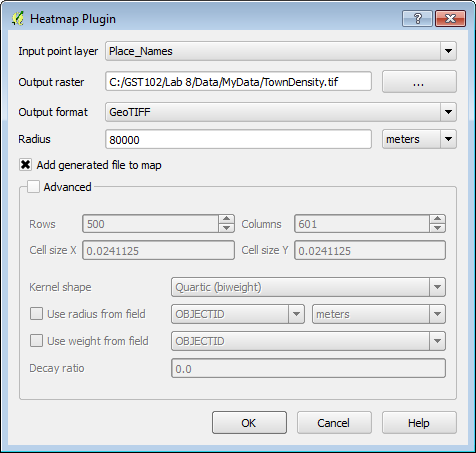

7. Restyle the Texas layer with a Fill style of Transparent fill and a thick yellow Border.  Drag the Texas layer to the top of the Layer panel (figure below).

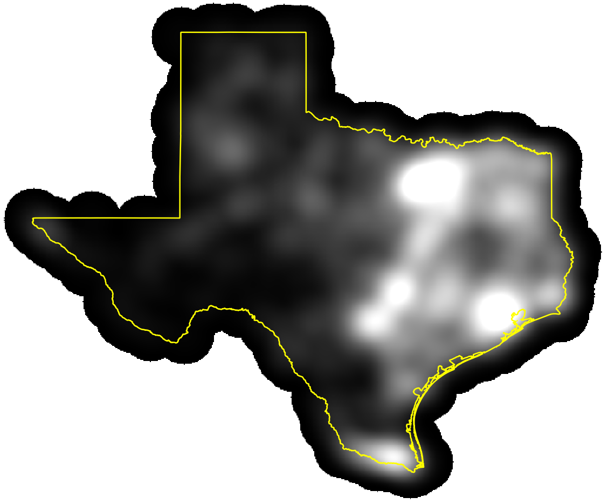

8. Now you will run the tool again but you will weight the town points by their population. Run the Heatmap tool again. This time name the Output TownPopDensity.tif. 
9. Check the Advanced box and check Use weight from field.
10. Choose POPULATION as the weight field. This will create a heat map based on the population values of each town (figure below). Click OK to execute the tool.

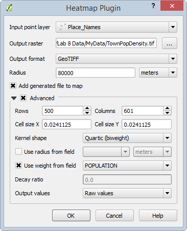

9. Move the newly created heatmap above the previous heatmap in the Layers panel.

Weighting the heatmap by a field provides a much more accurate picture of where the population centers are, rather than just town density (figure below).

10. Save your project.

### Task 2 Raster to Vector Conversion
Sometimes it is necessary to convert data between the two main data models: vector and raster. Here you will convert the population-based heat map to a vector dataset. Having the data in the vector data model allows for easier area calculations and different cartographic options (border and fill).

1. Open QGIS Desktop and open Lab 8 Data/Lab8.qgs

2. Open the Layer Properties | Style tab for the TownPopDensity raster. Set the following parameters.

	a. Render type = Singleband pseudocolor

	b. Color map = YlOrRd

	c. Mode = Continuous

	d. Accuracy = Actual (slower)

	e. Click Load

	f. Click Classify

	g. Click OK to apply and close the Layer Properties.

The map will now resemble the figure below. **(Note:** Here, the state outline has been changed to black for better contrast.)

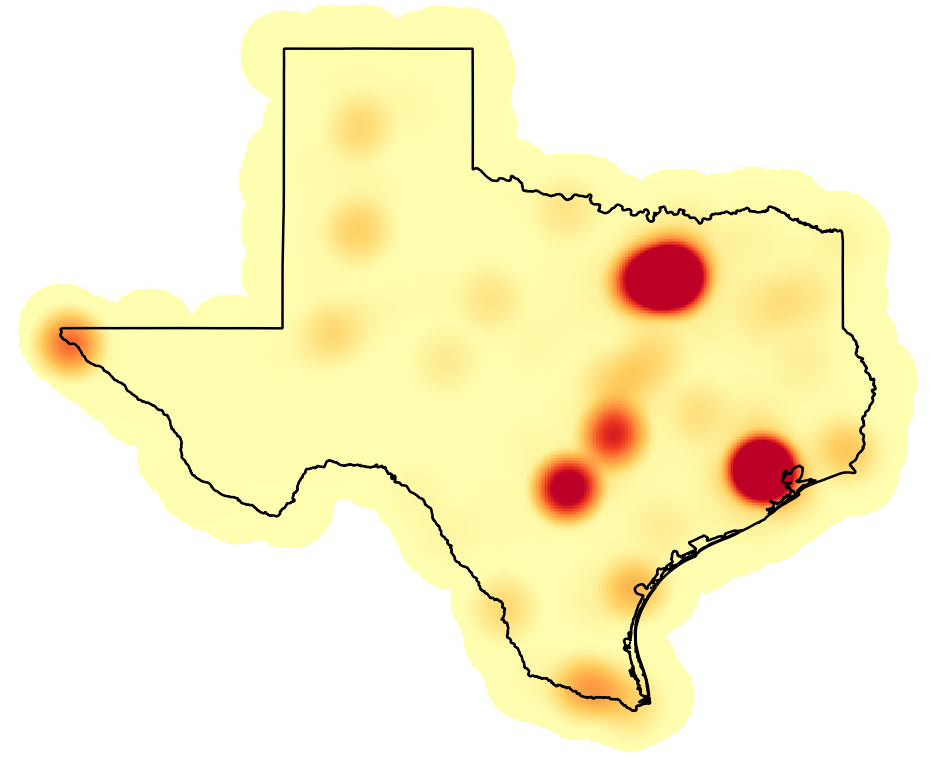

This is a more pleasing rendering and is very useful for a visual interpretation of population centers. However, if you wanted to have an actual layer of these population centers, the heat map needs to be further processed. You will now identify the highest population centers.

3. First, you need to decide on a threshold value that will constitute the population centers. There are a couple ways to do this: You can look at the values from the layer classification. You can also look at the Layer Properties | Histogram. Here you will use values greater than 800,000 as the threshold for population centers.

4. From the menu bar choose Raster | Raster Calculator.

	a. Double click on “TownPopDensity@1”

	b. Click on the > operator

	c. Type 800000 in as the value

	d. Output layer = Lab 8 Data/MyData/PopulationCenter.tif

	e. Output format = GeoTIFF

	f. Click OK (figure below).

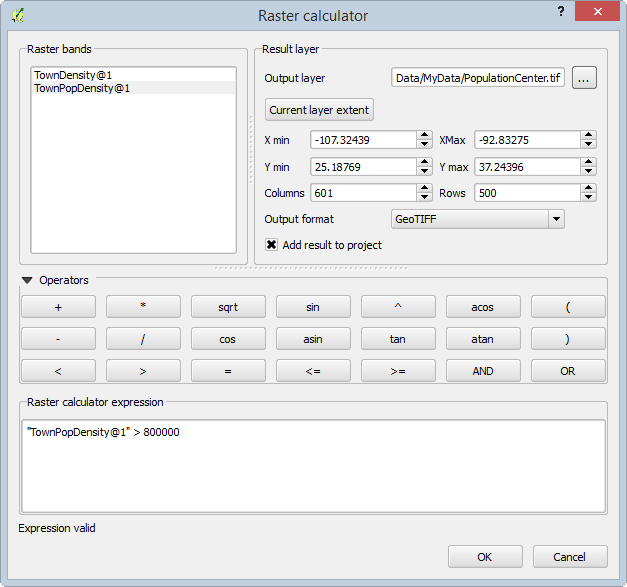

5. All the cells in the PopulationCenters raster input layer that had pixel values greater than 800,000 now have a value of 1, and the remaining pixels have a value of 0.
6. You will now convert the output to a vector layer. From the menu bar choose Raster | Conversion | Polygonize (Raster to Vector).

	a. Input file (raster) = PopulationCenter

	b. Output file for polygons (shapefile) = MyData/PopulationCenters.shp

	c. Check the box for Field name

	d. Click OK. (figure below)

	e. Click Close when complete.

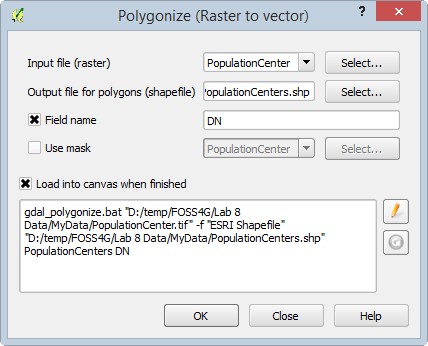

7. When the processing is complete, make sure the new polygon layer is above the raster layer in the Layers panel so that it is visible.

Since the output represents all the pixels in the raster you need to eliminate the non-population center polygons from this layer. To do this you will put the layer into Edit mode, select those polygons with a value of 0 and delete them. 

8. Right-click on the PopulationCenters polygon layer Layers panel and choose Toggle editing from the context menu.
9. Open the attribute table for the layer. Click the Select features using an expression button 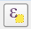 .
10. Expand Field and Values. Double click on DN to place it in the Expression window. Click the = operator. Now click the all unique button and double click on the 0 value to place it in the expression. (figure below)

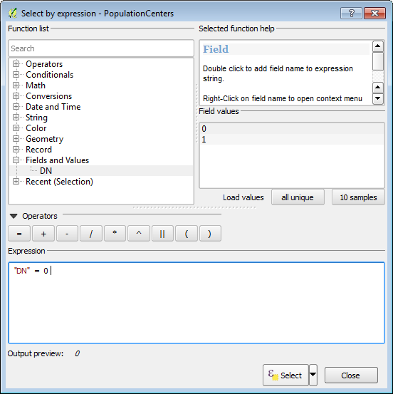

11. Click Select to execute the selection then click Close.
11. Now that the records with a value of zero are selected, and the layer is in edit mode, click the Delete selected features (DEL) 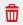 button.
12. Lastly click the Toggle editing mode 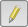 button and Save the changes.

The population centers are now a polygon layer you can use in a final map, or perhaps to feed into another analysis (figure below).

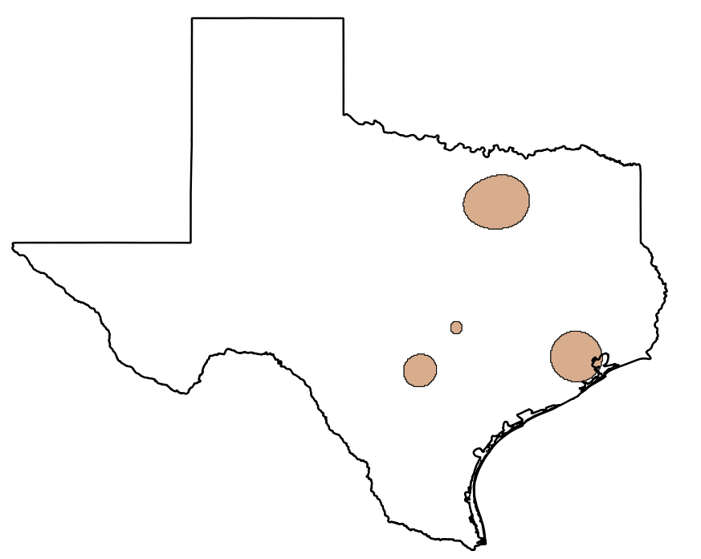

Now that the data are in polygon form, it is straightforward to calculate their acreage. QGIS calculates areas in the units of the coordinate reference system, therefore the layer needs to be in a Cartesian coordinate system with units of feet or meters. Currently it is in a Geographic coordinate system with values of decimal degrees. You will save the layer to a new coordinate reference system. Then you can calculate the square meters of the polygons and convert those to acres or square miles etc. 

12. Right click on the PopulationCenters polygon layer in the Layers panel and choose Save As…

	a.Save the layer as PopulationCenters_albers.shp

	b. Click the Browse button to open the Coordinate Reference System Selector. Type ‘Texas’ into the Filter window.

	c. Choose the NAD/83 Texas Centric Albers Equal Area EPSG:3083 CRS. Click OK.

	d. Check Add saved file to map

	e. Click OK

13. Open the attribute table for the PopulationCenters_albers polygon layer.

14. Click the Toggle editing mode button.

15. Click the New column button 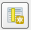  .

16. Name the column Acreage and make it a Decimal number (real) column. Give it a  Width of 7 and a Precision of 1 (figure below).

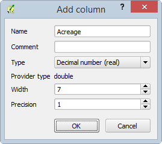

17. Click the Open field calculator 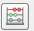  button.

	a. Click the Update existing field option

	b. Choose Acreage as that field

	c. Expand the Geometry Function list and double click $area

	d. Click the * operator

	e. Enter the conversion factor from square meters to acres 0.000247105 (figure below)

	f. Click OK.

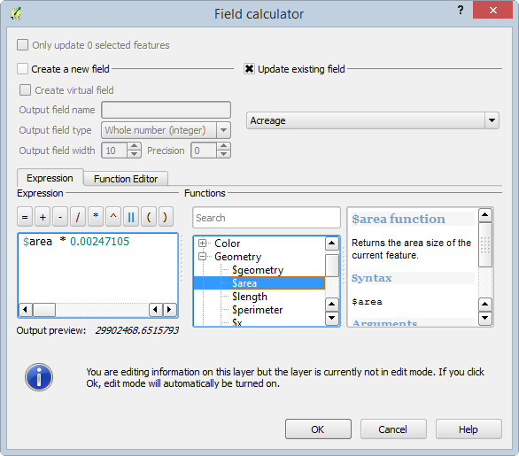

18. Toggle off editing and Save your results (figure below).

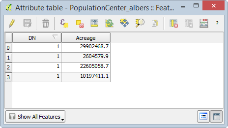

19. Now you have a layer of population centers and you have calculated their acreage!
20. Save your project.

### Task 3 Vector to Raster Conversion
It can also be very useful to have data represented in the raster data model. Rasters are very useful for analysis. In the last lab, you saw how rasters can be combined via the Raster Calculator. You can convert points, lines and polygons to a raster format. One must be cognizant of the effects of cell size. The data will be generalized when the conversion from precise vector locations to cells occurs. Here you will convert a vector layer to raster.

1. Open QGIS Desktop and open Lab 8 Data/Lab8.qgs.
2. Add the Nueces_Roads.shp to QGIS Desktop.
3. Right click on the Nueces Roads layer in the Layers panel and choose Zoom to layer (figure below).

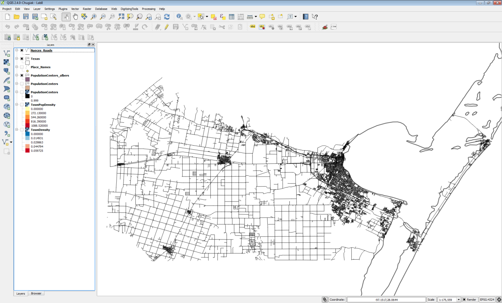

3. From the menu bar choose Raster | Conversion | Rasterize (Vector to Raster).

	a. Input file (shapefile) = Nueces_Roads

	b. Attribute field = TLID (*Note*: this can be any numeric attribute. Often it will be a field that assigned some sort of weight to the output raster cells. Here we will simply use the TLID column.)

	c. Output file for rasterized vectors (raster) = MyData/Roads_raster.tif (*Note*: If you get the message ‘The output file doesn’t exist. You must set up the output size or resolution to create it.’ Click OK.)

	d. Take the remaining defaults.

	e. Click OK. (figure below). Click OK and Close.

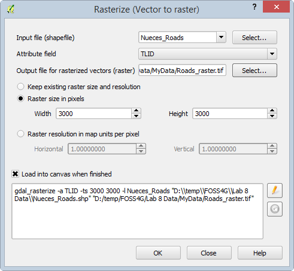

4. The resulting raster has values matching the TLID values for road pixels and values of 0 for the remaining pixels (figure below).

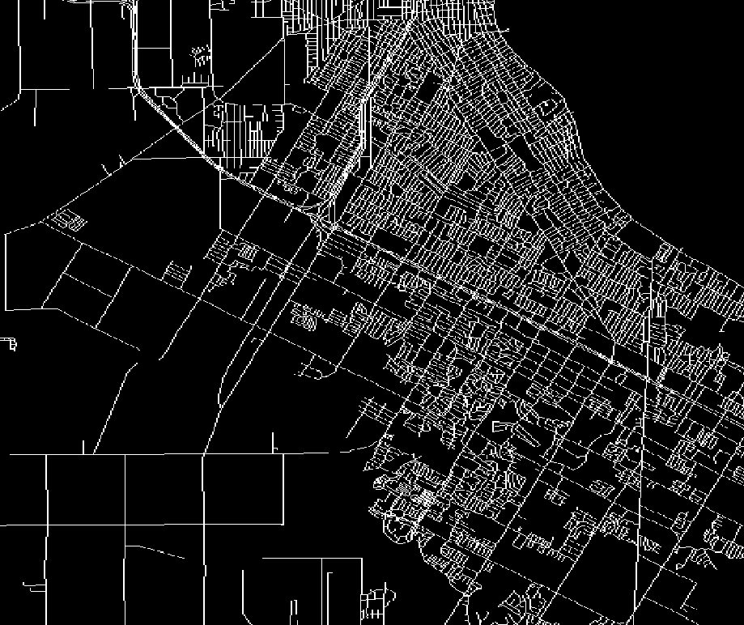

### 3 Conclusion

In this lab, you learned how to use the Heatmap plugin to generate point density rasters based off of both point densities and attribute values (population). Density analyses are often used to analyze data related to crimes, or the amount of fast food stores in an area. The output provides a nice overview of how close the points are, and you can choose our own variables to weight the output. Finally, using the conversion tools we can convert between raster and vector. Having data in raster form allows you to perform raster algebra operations via the Raster Calculator. Having the data in vector form allows for geometries to be easily calculated (acreage), and for more sophisticated cartographic options (border and fill).  

### 4 Discussion Questions

1. Discuss the different uses of point density.
2. Explain how weighting a feature via an attribute changes the outcome.
3. Is there anything we can do about the degradation of data in the conversion between vector and raster?

### 5 Challenge Assignment (optional)

In the Lab 8 Data/Challenge folder there is a shapefile containing crime data for Surrey in the United Kingdom. There is a column for crime type (Crime_type). Use this field to generate two heatmaps: one for ‘Violent Crimes’ and one for ‘Drugs’.  You will have to select records corresponding to each crime type, and save the selected features to a new shapefile for each. The heatmaps will be generated against the resulting shapefiles. 
